# 임원 일정 관리 시스템 - ERD

본 문서는 임원 일정 관리 시스템의 데이터 모델(ERD)을 정의한다. 모든 컬럼명은 `snake_case`로 통일하며, 모든 테이블은 공통 컬럼 `id` (UUID PK), `created_at`, `updated_at`을 가진다. soft delete 적용 테이블은 `deleted_at`, `deleted_by`를 추가로 가진다.

## 설계 결정 노트 (입력 자료 충돌 해소)

| 항목 | 결정 | 사유 |
|------|------|------|
| `holidays.type` enum | `statutory` / `substitute` / `temporary` (3종) | 작성 원칙 "기능명세서의 상태 enum과 100% 일치" 우선. 대체공휴일은 HOL-001 배치에서 별도 계산되므로 `statutory`와 분리 보존. |
| `contacts` soft delete | `status` enum (`auto`/`confirmed`) + `deleted_at` 분리 | "deleted" 의미 중복 회피. `deleted_at IS NOT NULL`이 곧 삭제 상태. |
| 임원 별도 테이블 | 두지 않음 | `users.role = 'user'`로 식별 (요구사항: admin/user 2종 역할). |
| 세션 테이블 | 두지 않음 | Supabase Auth가 세션 관리. |
| `schedules`의 상태 컬럼 | 별도 status 컬럼 없음. `deleted_at`으로 active/deleted 구분 | 작성 원칙 명시. |
| `schedules.type` enum | `personal` / `common` (공휴일은 별도 `holidays` 테이블) | spec 03에서 분리 관리됨. |
| `audit_logs` 구조 | 범용 `target_type` + `target_id` (schedule 전용 아님) | 작성 원칙 명시. spec 12의 `schedule_id`를 `target_id`로 일반화. |
| 알림 테이블명 | `notification_logs` 단일 | 작성 원칙 명시. |

---

## 1. ERD 전체 다이어그램

```mermaid
erDiagram
    USERS ||--o{ SCHEDULES : "owns (owner_id)"
    USERS ||--o{ SCHEDULES : "creates (created_by)"
    USERS ||--o{ PROXY_PERMISSIONS : "is proxy (proxy_user_id)"
    USERS ||--o{ PROXY_PERMISSIONS : "is target (target_user_id)"
    USERS ||--o{ PROXY_PERMISSIONS : "grants (granted_by)"
    USERS ||--o{ PROXY_PERMISSIONS : "revokes (revoked_by)"
    USERS ||--o{ SCHEDULE_PARTICIPANTS : "joins (user_id)"
    USERS ||--o{ AUDIT_LOGS : "acts (actor_id)"
    USERS ||--o{ AUDIT_LOGS : "on behalf of (on_behalf_of_id)"
    USERS ||--o{ NOTIFICATION_LOGS : "receives (recipient_id)"
    USERS ||--o{ HOLIDAYS : "creates (created_by)"
    USERS ||--o{ COMPANIES : "creates (created_by)"
    USERS ||--o{ CONTACTS : "creates (created_by)"

    COMPANIES ||--o{ CONTACTS : "employs (company_id)"

    SCHEDULES ||--o{ SCHEDULE_PARTICIPANTS : "has (schedule_id)"
    SCHEDULES ||--o{ MENTIONS : "has (schedule_id)"

    CONTACTS ||--o{ MENTIONS : "referenced by (reference_id, type=contact)"
    COMPANIES ||--o{ MENTIONS : "referenced by (reference_id, type=company)"

    USERS {
        uuid id PK
        text email UK "UNIQUE, NOT NULL"
        text employee_id UK "UNIQUE, NOT NULL, 6~10자리"
        text name "NOT NULL"
        text role "admin | user, NOT NULL"
        text status "pending|active|inactive|locked, NOT NULL"
        text color "임원 색상 (#RRGGBB), NULLABLE"
        timestamptz last_login_at
        int failed_login_count "DEFAULT 0"
        timestamptz locked_until
        timestamptz created_at
        timestamptz updated_at
        timestamptz deleted_at
        uuid deleted_by FK
    }

    COMPANIES {
        uuid id PK
        text name UK "UNIQUE 활성 항목 기준"
        text_array aliases "TEXT[]"
        bool is_auto_registered "DEFAULT false"
        uuid created_by FK
        timestamptz created_at
        timestamptz updated_at
        timestamptz deleted_at
        uuid deleted_by FK
    }

    CONTACTS {
        uuid id PK
        text name "NOT NULL"
        uuid company_id FK "NULLABLE"
        text title "직책"
        text email
        text phone
        text status "auto | confirmed, DEFAULT auto"
        bool is_auto_registered "DEFAULT false"
        uuid created_by FK
        timestamptz created_at
        timestamptz updated_at
        timestamptz deleted_at
        uuid deleted_by FK
    }

    SCHEDULES {
        uuid id PK
        text type "personal | common, NOT NULL"
        uuid owner_id FK "personal일 때 NOT NULL"
        date schedule_date "NOT NULL"
        text time_slot "morning|lunch|afternoon|evening|allday"
        time start_time
        time end_time
        bool is_all_day "DEFAULT false"
        text title "NOT NULL, 1~200자"
        text location
        text memo "비고, 최대 500자"
        uuid created_by FK "실제 작성자"
        uuid on_behalf_of_id FK "대리 입력 시 명의 임원, NULLABLE"
        timestamptz created_at
        timestamptz updated_at
        timestamptz deleted_at
        uuid deleted_by FK
    }

    SCHEDULE_PARTICIPANTS {
        uuid id PK
        uuid schedule_id FK
        uuid user_id FK
        text status "joined | cancelled, DEFAULT joined"
        timestamptz joined_at
        timestamptz cancelled_at
        uuid added_by FK
        timestamptz created_at
        timestamptz updated_at
    }

    MENTIONS {
        uuid id PK
        uuid schedule_id FK
        text reference_type "contact | company"
        uuid reference_id "참조 대상 ID"
        text raw_text "원본 입력 텍스트"
        timestamptz created_at
    }

    PROXY_PERMISSIONS {
        uuid id PK
        uuid proxy_user_id FK "대리 입력자"
        uuid target_user_id FK "대상 임원"
        uuid granted_by FK "권한 부여한 관리자"
        timestamptz granted_at
        uuid revoked_by FK "권한 해제한 관리자"
        timestamptz revoked_at "NULL이면 active"
        timestamptz created_at
        timestamptz updated_at
    }

    HOLIDAYS {
        uuid id PK
        date holiday_date UK
        text name "NOT NULL, 1~50자"
        text type "statutory|substitute|temporary"
        int year "NOT NULL"
        text original_holiday_name "대체공휴일 원공휴일명"
        text memo "임시 공휴일 사유"
        bool is_active "DEFAULT true"
        uuid created_by FK "NULLABLE (시스템 등록 시)"
        timestamptz created_at
        timestamptz updated_at
        timestamptz deleted_at
        uuid deleted_by FK
    }

    NOTIFICATION_LOGS {
        uuid id PK
        text event_type "common_schedule_created | common_schedule_updated | schedule_updated_by_other | invite | password_reset"
        uuid recipient_id FK "수신자 user_id"
        text recipient_email
        text target_type "schedule | user | null"
        uuid target_id "관련 대상 ID, NULLABLE"
        text channel "email"
        text status "pending|retrying|sent|failed|skipped"
        int attempt_count "DEFAULT 0"
        timestamptz last_attempted_at
        timestamptz sent_at
        timestamptz read_at "수신자가 알림을 읽은 시각, NULLABLE"
        text error_message
        jsonb payload "메일 본문 데이터 스냅샷"
        timestamptz created_at
        timestamptz updated_at
    }

    AUDIT_LOGS {
        uuid id PK
        text target_type "schedule | contact | company | proxy_permission | holiday | user"
        uuid target_id "대상 레코드 ID"
        text action "created | updated | deleted"
        uuid actor_id FK "실제 작업자"
        text actor_name_snapshot "스냅샷"
        uuid on_behalf_of_id FK "대리 입력 시 명의 임원, NULLABLE"
        text on_behalf_of_name_snapshot
        jsonb before_data "변경 전 (created 시 NULL)"
        jsonb after_data "변경 후 (deleted 시 NULL)"
        text_array changed_fields "TEXT[]"
        text ip_address
        timestamptz created_at
    }
```

---

## 2. 엔티티 목록표

| 엔티티 ID | 테이블명 | 한글명 | 설명 | 핵심 상태값 |
|-----------|---------|--------|------|-------------|
| E01 | `users` | 사용자 | 관리자 및 일반 사용자(임원) 통합 | `status`: pending / active / inactive / locked |
| E02 | `companies` | 회사 | 멘션 대상 회사 (별칭 배열 보유) | `deleted_at`으로 active/deleted 구분 |
| E03 | `contacts` | 연락처 | 회사 소속 인물 연락처 | `status`: auto / confirmed (+ `deleted_at`로 deleted 표현) |
| E04 | `schedules` | 일정 | 개인/공통 일정 (공휴일 제외) | `deleted_at`으로 active/deleted 구분 |
| E05 | `schedule_participants` | 일정 참가자 | 공통 일정 참가자 (자기 추가 방식) | `status`: joined / cancelled |
| E06 | `mentions` | 멘션 | 일정-연락처/회사 연결 (다형성) | — |
| E07 | `proxy_permissions` | 대리 입력 권한 | 임원 A → 비서 B 대리 입력 권한 | `revoked_at`으로 active/revoked 구분 |
| E08 | `holidays` | 공휴일 | 법정/대체/임시 공휴일 | `type`: statutory / substitute / temporary |
| E09 | `notification_logs` | 알림 로그 | 알림 이력 및 발송 상태 | `status`: pending / retrying / sent / failed / skipped |
| E10 | `audit_logs` | 감사 로그 | 모든 변경 이력 (범용) | `action`: created / updated / deleted |

---

## 3. 엔티티별 상세 정의

### E01. users (사용자)

**관련 기능**: spec/01_auth.md (AUTH-001, AUTH-002, AUTH-003, AUTH-004), spec/02_permission.md (PERM-001, PERM-004), spec/11_notification.md (NOT-001, NOT-004) / proc_01_auth.md, proc_02_permission.md

핵심 컬럼 인라인 매핑:
- `role` (`admin` / `user`): PERM-001 역할 기반 접근 제어 분기 키
- `status` (`pending` / `active` / `inactive` / `locked`): AUTH-001 초대 시 `pending` → AUTH-002 로그인 시 활성화 / 5회 실패 시 `locked`
- `email`, `employee_id`: AUTH-002 이중 로그인 ID. AUTH-001 초대 시 이메일 발송 대상
- `failed_login_count`, `locked_until`: AUTH-002 5회 실패 → 15분 잠금 자동 해제 배치
- `color`: CAL-004 임원별 색상 레이어 ON/OFF + CAL-005 공통 일정 별도 색상 표시

| 항목 | 값 |
|------|---|
| 테이블명 | `users` |
| 한글명 | 사용자 |
| 설명 | 시스템 사용자(관리자, 일반 임원). 임원은 `role='user'`로 식별. 별도 `executives` 테이블을 두지 않는다. |
| Phase | 1 |
| Soft Delete | 적용 (deleted_at, deleted_by) |

#### 컬럼 정의

| 컬럼명 | 타입 | NULL | 기본값 | PK/FK/UQ | 설명 |
|--------|------|:----:|--------|----------|------|
| `id` | uuid | N | `gen_random_uuid()` | PK | 사용자 고유 식별자 |
| `email` | text | N | — | UQ | 이메일, 로그인 ID |
| `employee_id` | text | N | — | UQ | 사번 (숫자 6~10자리), 로그인 ID |
| `name` | text | N | — | — | 사용자 이름 (1~50자) |
| `role` | text | N | `'user'` | CHECK | `admin` 또는 `user` |
| `status` | text | N | `'pending'` | CHECK | `pending` / `active` / `inactive` / `locked` |
| `color` | text | Y | NULL | — | 임원별 달력 색상 (`#RRGGBB`). 관리자는 NULL 가능 |
| `last_login_at` | timestamptz | Y | NULL | — | 마지막 로그인 시각 |
| `failed_login_count` | int | N | `0` | — | 로그인 연속 실패 횟수 (5회 도달 시 locked) |
| `locked_until` | timestamptz | Y | NULL | — | 잠금 해제 예정 시각 (15분) |
| `created_at` | timestamptz | N | `now()` | — | 생성 시각 |
| `updated_at` | timestamptz | N | `now()` | — | 마지막 수정 시각 |
| `deleted_at` | timestamptz | Y | NULL | — | 논리 삭제 시각 |
| `deleted_by` | uuid | Y | NULL | FK→users.id | 삭제 처리자 |

#### 제약조건

- **PK**: `id`
- **UNIQUE**: `email`, `employee_id` (각각 deleted_at IS NULL인 활성 행 기준 부분 unique 인덱스 권장)
- **FK**: `deleted_by` → `users.id` (ON DELETE SET NULL, ON UPDATE CASCADE)
- **CHECK**:
  - `role IN ('admin', 'user')`
  - `status IN ('pending', 'active', 'inactive', 'locked')`
  - `employee_id ~ '^\d{6,10}$'`
  - `email ~* '^[A-Z0-9._%+-]+@[A-Z0-9.-]+\.[A-Z]{2,}$'`
  - `failed_login_count >= 0`

> **비고**: 비밀번호는 Supabase Auth에서 관리되므로 본 테이블에 컬럼을 두지 않는다.

---

### E02. companies (회사)

**관련 기능**: spec/04_mention_contact.md (MEN-001, MEN-002, CON-005), spec/10_relationship_history.md (REL-002) / proc_04_mention_contact.md, proc_07_relationship_history.md

핵심 컬럼 인라인 매핑:
- `name`: MEN-001 자동완성 prefix 검색 / CON-005 회사 중복 검사
- `aliases` (text[]): MEN-001 별칭 자동완성 (idx_companies_aliases_gin GIN 인덱스 활용)
- `is_auto_registered`: MEN-002 자동 등록 식별 플래그

| 항목 | 값 |
|------|---|
| 테이블명 | `companies` |
| 한글명 | 회사 |
| 설명 | 멘션 대상 회사. 공식 회사명 + 별칭 배열을 가진다. |
| Phase | 2 |
| Soft Delete | 적용 |

#### 컬럼 정의

| 컬럼명 | 타입 | NULL | 기본값 | PK/FK/UQ | 설명 |
|--------|------|:----:|--------|----------|------|
| `id` | uuid | N | `gen_random_uuid()` | PK | 회사 고유 식별자 |
| `name` | text | N | — | — | 공식 회사명 (1~100자) |
| `aliases` | text[] | N | `'{}'` | — | 별칭 배열 (예: `{삼성전자, Samsung, SEC}`) |
| `is_auto_registered` | bool | N | `false` | — | 멘션을 통해 자동 등록되었는지 여부 |
| `created_by` | uuid | N | — | FK→users.id | 최초 등록자 |
| `created_at` | timestamptz | N | `now()` | — | 생성 시각 |
| `updated_at` | timestamptz | N | `now()` | — | 마지막 수정 시각 |
| `deleted_at` | timestamptz | Y | NULL | — | 논리 삭제 시각 |
| `deleted_by` | uuid | Y | NULL | FK→users.id | 삭제 처리자 |

#### 제약조건

- **PK**: `id`
- **UNIQUE**: 활성 행 기준 `LOWER(name)` 부분 unique 인덱스. 별칭 중복은 애플리케이션 레벨에서 검증.
- **FK**: `created_by`, `deleted_by` → `users.id` (ON DELETE RESTRICT / SET NULL, ON UPDATE CASCADE)
- **CHECK**: `length(name) BETWEEN 1 AND 100`

---

### E03. contacts (연락처)

**관련 기능**: spec/04_mention_contact.md (MEN-001, MEN-002, CON-001, CON-002, CON-003, CON-004), spec/10_relationship_history.md (REL-001, REL-002) / proc_04_mention_contact.md, proc_07_relationship_history.md

핵심 컬럼 인라인 매핑:
- `status` (`auto` / `confirmed`): MEN-002 자동 등록 시 `auto`, CON-002 관리자 확정 시 `confirmed`
- `company_id` (FK→companies): CON-005 회사 삭제 시 SET NULL 동작
- `is_auto_registered`: MEN-002 자동 등록 식별 플래그

| 항목 | 값 |
|------|---|
| 테이블명 | `contacts` |
| 한글명 | 연락처 |
| 설명 | 회사 소속 인물의 연락처. @멘션을 통해 자동 등록되거나 관리자가 직접 등록. |
| Phase | 2 |
| Soft Delete | 적용 |

#### 컬럼 정의

| 컬럼명 | 타입 | NULL | 기본값 | PK/FK/UQ | 설명 |
|--------|------|:----:|--------|----------|------|
| `id` | uuid | N | `gen_random_uuid()` | PK | 연락처 고유 식별자 |
| `name` | text | N | — | — | 이름 (1~50자) |
| `company_id` | uuid | Y | NULL | FK→companies.id | 소속 회사 |
| `title` | text | Y | NULL | — | 직책 (최대 50자) |
| `email` | text | Y | NULL | — | 이메일 (최대 100자) |
| `phone` | text | Y | NULL | — | 전화번호 (최대 20자) |
| `status` | text | N | `'auto'` | CHECK | `auto` / `confirmed` |
| `is_auto_registered` | bool | N | `false` | — | 멘션을 통해 자동 등록되었는지 여부 |
| `created_by` | uuid | N | — | FK→users.id | 최초 등록자 |
| `created_at` | timestamptz | N | `now()` | — | 생성 시각 |
| `updated_at` | timestamptz | N | `now()` | — | 마지막 수정 시각 |
| `deleted_at` | timestamptz | Y | NULL | — | 논리 삭제 시각 (NOT NULL이면 deleted 상태) |
| `deleted_by` | uuid | Y | NULL | FK→users.id | 삭제 처리자 |

#### 제약조건

- **PK**: `id`
- **FK**:
  - `company_id` → `companies.id` (ON DELETE SET NULL, ON UPDATE CASCADE)
  - `created_by`, `deleted_by` → `users.id`
- **CHECK**:
  - `status IN ('auto', 'confirmed')`
  - `length(name) BETWEEN 1 AND 50`
  - 이메일 입력 시 형식 검증 (`email IS NULL OR email ~* '...'`)

> **상태 의미**: 본 시스템은 작성 원칙의 `contacts.status: auto/confirmed/deleted` 중 `deleted`를 별도 status가 아닌 `deleted_at IS NOT NULL`로 표현한다. (status 컬럼과 soft delete 패턴 충돌 회피)

---

### E04. schedules (일정)

**관련 기능**: spec/03_schedule.md (SCH-001~006), spec/05_calendar_view.md (CAL-001~009), spec/06_list_view.md (LIS-001~007), spec/07_common_schedule.md (COM-001, COM-003, COM-004), spec/09_meeting_radar.md (RAD-002, RAD-004), spec/12_audit_log.md (AUD-001, AUD-002) / proc_03_schedule.md, proc_06_meeting_radar.md, proc_09_audit_log.md

핵심 컬럼 인라인 매핑:
- `type` (`personal` / `common`): SCH-001 vs SCH-002 / COM-001 분기 기준
- `owner_id` (FK→users): personal 일정 주인. CAL-001~003 임원별 달력 핵심 필터
- `on_behalf_of_id` (FK→users): PERM-003, SCH-006 대리 입력 시 명의 임원
- `time_slot`: RAD-002 모임 레이더 충돌 계산 단위 / CAL-002·CAL-003 주간·일간 뷰 시간대 슬롯 렌더링
- `created_by` vs `on_behalf_of_id`: AUD-003 대리 입력 이력 구분 키

| 항목 | 값 |
|------|---|
| 테이블명 | `schedules` |
| 한글명 | 일정 |
| 설명 | 개인 일정 또는 공통 일정. 공휴일은 별도 `holidays` 테이블에서 관리. |
| Phase | 1 |
| Soft Delete | 적용 (active/deleted 구분 = deleted_at) |

#### 컬럼 정의

| 컬럼명 | 타입 | NULL | 기본값 | PK/FK/UQ | 설명 |
|--------|------|:----:|--------|----------|------|
| `id` | uuid | N | `gen_random_uuid()` | PK | 일정 고유 식별자 |
| `type` | text | N | — | CHECK | `personal` / `common` |
| `owner_id` | uuid | Y | NULL | FK→users.id | 일정 주인 임원 (personal일 때 NOT NULL, common일 때는 NULL 가능 — 참가자는 schedule_participants에서 관리) |
| `schedule_date` | date | N | — | — | 일정 날짜 |
| `time_slot` | text | N | — | CHECK | `morning` / `lunch` / `afternoon` / `evening` / `allday` |
| `start_time` | time | Y | NULL | — | 실제 시작 시각 |
| `end_time` | time | Y | NULL | — | 실제 종료 시각 |
| `is_all_day` | bool | N | `false` | — | 종일 일정 여부 |
| `title` | text | N | — | — | 일정 내용 (1~200자) |
| `location` | text | Y | NULL | — | 장소 (최대 100자) |
| `memo` | text | Y | NULL | — | 비고 (최대 500자) |
| `created_by` | uuid | N | — | FK→users.id | 실제 작성자 |
| `on_behalf_of_id` | uuid | Y | NULL | FK→users.id | 대리 입력 시 명의 임원 (NULL이면 직접 입력) |
| `created_at` | timestamptz | N | `now()` | — | 생성 시각 |
| `updated_at` | timestamptz | N | `now()` | — | 마지막 수정 시각 |
| `deleted_at` | timestamptz | Y | NULL | — | 논리 삭제 시각 |
| `deleted_by` | uuid | Y | NULL | FK→users.id | 삭제 처리자 |

#### 제약조건

- **PK**: `id`
- **FK**:
  - `owner_id`, `created_by`, `on_behalf_of_id`, `deleted_by` → `users.id` (ON DELETE RESTRICT, ON UPDATE CASCADE)
- **CHECK**:
  - `type IN ('personal', 'common')`
  - `time_slot IN ('morning', 'lunch', 'afternoon', 'evening', 'allday')`
  - `length(title) BETWEEN 1 AND 200`
  - `(start_time IS NULL OR end_time IS NULL OR start_time < end_time)`
  - `(type = 'personal' AND owner_id IS NOT NULL) OR (type = 'common')`
  - `(is_all_day = false) OR (start_time IS NULL AND end_time IS NULL AND time_slot = 'allday')`

> **비고**: 일정 자체에 별도 `status` enum을 두지 않는다. `deleted_at IS NULL`이면 `active`, NOT NULL이면 `deleted`로 간주한다.

---

### E05. schedule_participants (일정 참가자)

**관련 기능**: spec/07_common_schedule.md (COM-002), spec/05_calendar_view.md (CAL-001, CAL-005), spec/11_notification.md (NOT-002) / proc_03_schedule.md, proc_05_notification.md

핵심 컬럼 인라인 매핑:
- `status` (`joined` / `cancelled`): COM-002 자기 추가/취소 토글. 이력 보존을 위해 soft delete 대신 status 사용
- `user_id` (FK→users): NOT-002 공통 일정 수정 시 알림 대상 목록 산출

| 항목 | 값 |
|------|---|
| 테이블명 | `schedule_participants` |
| 한글명 | 일정 참가자 |
| 설명 | 공통 일정의 참가자 목록. 임원이 본인을 직접 추가하는 방식 (수락/거절 없음). |
| Phase | 1 |
| Soft Delete | 미적용 (status로 cancelled 표현, 이력 보존) |

#### 컬럼 정의

| 컬럼명 | 타입 | NULL | 기본값 | PK/FK/UQ | 설명 |
|--------|------|:----:|--------|----------|------|
| `id` | uuid | N | `gen_random_uuid()` | PK | 참가자 레코드 ID |
| `schedule_id` | uuid | N | — | FK→schedules.id | 공통 일정 ID |
| `user_id` | uuid | N | — | FK→users.id | 참가 임원 ID |
| `status` | text | N | `'joined'` | CHECK | `joined` / `cancelled` |
| `joined_at` | timestamptz | N | `now()` | — | 최초 참가 시각 |
| `cancelled_at` | timestamptz | Y | NULL | — | 취소 시각 (재참가 시 갱신 가능) |
| `added_by` | uuid | N | — | FK→users.id | 본인이 본인을 추가하는 것이 원칙. 관리자 강제 추가 시 관리자 ID |
| `created_at` | timestamptz | N | `now()` | — | 레코드 생성 시각 |
| `updated_at` | timestamptz | N | `now()` | — | 마지막 수정 시각 |

#### 제약조건

- **PK**: `id`
- **UNIQUE**: `(schedule_id, user_id)` — 동일 임원의 중복 레코드 방지 (재참가 시 기존 레코드 업데이트)
- **FK**:
  - `schedule_id` → `schedules.id` (ON DELETE CASCADE, ON UPDATE CASCADE)
  - `user_id`, `added_by` → `users.id` (ON DELETE RESTRICT, ON UPDATE CASCADE)
- **CHECK**: `status IN ('joined', 'cancelled')`

---

### E06. mentions (멘션)

**관련 기능**: spec/04_mention_contact.md (MEN-001, MEN-002), spec/03_schedule.md (SCH-005), spec/10_relationship_history.md (REL-001, REL-002) / proc_04_mention_contact.md, proc_07_relationship_history.md

핵심 컬럼 인라인 매핑:
- `reference_type` (`contact` / `company`): MEN-001 멘션 대상 유형 분기 (다형성 참조)
- `reference_id`: REL-002 미팅 히스토리 조회 시 회사/사람별 집계 키
- `schedule_id` (FK→schedules): 일정 삭제 시 CASCADE / SCH-005 일정 상세 시 멘션 로드

| 항목 | 값 |
|------|---|
| 테이블명 | `mentions` |
| 한글명 | 멘션 |
| 설명 | 일정-연락처/회사 연결. 다형성 참조 (`reference_type` + `reference_id`) |
| Phase | 2 |
| Soft Delete | 미적용 (일정 삭제 시 CASCADE) |

#### 컬럼 정의

| 컬럼명 | 타입 | NULL | 기본값 | PK/FK/UQ | 설명 |
|--------|------|:----:|--------|----------|------|
| `id` | uuid | N | `gen_random_uuid()` | PK | 멘션 ID |
| `schedule_id` | uuid | N | — | FK→schedules.id | 연결된 일정 |
| `reference_type` | text | N | — | CHECK | `contact` / `company` |
| `reference_id` | uuid | N | — | — | `contacts.id` 또는 `companies.id` (다형성, FK 제약 미설정) |
| `raw_text` | text | N | — | — | 사용자가 입력한 원본 멘션 텍스트 |
| `created_at` | timestamptz | N | `now()` | — | 생성 시각 |

#### 제약조건

- **PK**: `id`
- **FK**: `schedule_id` → `schedules.id` (ON DELETE CASCADE, ON UPDATE CASCADE)
- **다형성 FK**: `reference_id`는 `reference_type`에 따라 `contacts.id` 또는 `companies.id`를 참조. DB 레벨 FK 제약은 두지 않고 애플리케이션·트리거로 무결성 보장.
- **CHECK**: `reference_type IN ('contact', 'company')`
- **UNIQUE**: `(schedule_id, reference_type, reference_id)` — 동일 일정에 동일 대상 중복 멘션 방지

---

### E07. proxy_permissions (대리 입력 권한)

**관련 기능**: spec/02_permission.md (PERM-002, PERM-003), spec/03_schedule.md (SCH-006), spec/12_audit_log.md (AUD-003) / proc_02_permission.md, proc_09_audit_log.md

핵심 컬럼 인라인 매핑:
- `proxy_user_id` (FK→users): SCH-006 "내가 대리 입력 가능한 임원 목록" 조회 키
- `target_user_id` (FK→users): PERM-002 임원별 대리인 목록 조회 키
- `revoked_at`: NULL=active / NOT NULL=revoked (soft delete 대신 상태 표현). PERM-002 권한 해제

| 항목 | 값 |
|------|---|
| 테이블명 | `proxy_permissions` |
| 한글명 | 대리 입력 권한 |
| 설명 | "사용자 A(proxy_user_id)가 임원 B(target_user_id)의 이름으로 일정을 입력할 수 있다"는 권한. revoked_at으로 이력 보존. |
| Phase | 2 |
| Soft Delete | 미적용 (revoked_at으로 표현) |

#### 컬럼 정의

| 컬럼명 | 타입 | NULL | 기본값 | PK/FK/UQ | 설명 |
|--------|------|:----:|--------|----------|------|
| `id` | uuid | N | `gen_random_uuid()` | PK | 권한 ID |
| `proxy_user_id` | uuid | N | — | FK→users.id | 대리 입력자 (A) |
| `target_user_id` | uuid | N | — | FK→users.id | 대상 임원 (B) |
| `granted_by` | uuid | N | — | FK→users.id | 권한을 부여한 관리자 |
| `granted_at` | timestamptz | N | `now()` | — | 부여 시각 |
| `revoked_by` | uuid | Y | NULL | FK→users.id | 권한을 해제한 관리자 |
| `revoked_at` | timestamptz | Y | NULL | — | 해제 시각 (NULL이면 active) |
| `created_at` | timestamptz | N | `now()` | — | 생성 시각 |
| `updated_at` | timestamptz | N | `now()` | — | 마지막 수정 시각 |

#### 제약조건

- **PK**: `id`
- **UNIQUE 부분 인덱스**: `(proxy_user_id, target_user_id) WHERE revoked_at IS NULL` — 동일 조합 중복 활성 권한 금지
- **FK**:
  - `proxy_user_id`, `target_user_id`, `granted_by`, `revoked_by` → `users.id` (ON DELETE RESTRICT, ON UPDATE CASCADE)
- **CHECK**:
  - `proxy_user_id <> target_user_id` (본인에게 대리 권한 부여 금지)
  - `(revoked_at IS NULL AND revoked_by IS NULL) OR (revoked_at IS NOT NULL AND revoked_by IS NOT NULL)` (해제 정보 동시 설정)

---

### E08. holidays (공휴일)

**관련 기능**: spec/08_holiday.md (HOL-001, HOL-002, HOL-003, HOL-004), spec/05_calendar_view.md (CAL-006) / proc_08_holiday.md

핵심 컬럼 인라인 매핑:
- `type` (`statutory` / `substitute` / `temporary`): HOL-001 배치(`statutory`, `substitute`) vs HOL-002 관리자 수동(`temporary`)
- `holiday_date`: CAL-006 달력 렌더링 기간별 조회 키
- `original_holiday_name`: HOL-001 대체공휴일 배치 시 원공휴일 매핑
- `is_active` / `deleted_at`: HOL-003 삭제 시 soft delete

| 항목 | 값 |
|------|---|
| 테이블명 | `holidays` |
| 한글명 | 공휴일 |
| 설명 | 법정·대체·임시 공휴일. HOL-001 배치가 자동 등록(statutory/substitute), 관리자가 수동 등록(temporary). |
| Phase | 2 |
| Soft Delete | 적용 |

#### 컬럼 정의

| 컬럼명 | 타입 | NULL | 기본값 | PK/FK/UQ | 설명 |
|--------|------|:----:|--------|----------|------|
| `id` | uuid | N | `gen_random_uuid()` | PK | 공휴일 ID |
| `holiday_date` | date | N | — | — | 공휴일 날짜 |
| `name` | text | N | — | — | 명칭 (1~50자) |
| `type` | text | N | — | CHECK | `statutory` / `substitute` / `temporary` |
| `year` | int | N | — | — | 연도 (배치 기준 컬럼) |
| `original_holiday_name` | text | Y | NULL | — | 대체공휴일인 경우 원 공휴일명 |
| `memo` | text | Y | NULL | — | 임시 공휴일 사유 (최대 200자) |
| `is_active` | bool | N | `true` | — | 활성 여부 (소프트 삭제 시 false) |
| `created_by` | uuid | Y | NULL | FK→users.id | 등록자 (시스템 자동 등록 시 NULL) |
| `created_at` | timestamptz | N | `now()` | — | 생성 시각 |
| `updated_at` | timestamptz | N | `now()` | — | 마지막 수정 시각 |
| `deleted_at` | timestamptz | Y | NULL | — | 삭제 시각 |
| `deleted_by` | uuid | Y | NULL | FK→users.id | 삭제 처리자 |

#### 제약조건

- **PK**: `id`
- **UNIQUE 부분 인덱스**: `(holiday_date, type) WHERE deleted_at IS NULL` — 동일 날짜+동일 유형 중복 활성 공휴일 금지 (단, 임시 공휴일과 법정 공휴일이 같은 날 공존 가능)
- **FK**: `created_by`, `deleted_by` → `users.id`
- **CHECK**:
  - `type IN ('statutory', 'substitute', 'temporary')`
  - `length(name) BETWEEN 1 AND 50`
  - `year = EXTRACT(YEAR FROM holiday_date)`
  - `(type = 'substitute' AND original_holiday_name IS NOT NULL) OR (type <> 'substitute')`

> **작성 원칙과의 차이**: 작성 원칙은 `legal/temporary` 2종을 명시했으나, spec 08의 enum과 100% 일치 원칙에 따라 `statutory/substitute/temporary` 3종을 채택한다. 대체공휴일은 HOL-001 배치 로직이 별도 계산하여 별도 type으로 보존한다.

---

### E09. notification_logs (알림 로그)

**관련 기능**: spec/11_notification.md (NOT-001, NOT-002, NOT-003, NOT-004, NOT-005, NOT-006), spec/01_auth.md (AUTH-001, AUTH-003) / proc_05_notification.md, proc_01_auth.md

핵심 컬럼 인라인 매핑:
- `event_type`: NOT-001 (`common_schedule_created`), NOT-002 (`common_schedule_updated`), NOT-003 (`schedule_updated_by_other`), NOT-004 (`invite`), NOT-005 (`password_reset`)
- `status` (`pending`/`retrying`/`sent`/`failed`/`skipped`): NOT-006 발송 이력 데이터 모델 + NOT-001 예외 처리(지수 백오프 3회 재시도) 워커 픽업 키
- `attempt_count`: 초기 1회 + 재시도 3회 (최대 4)
- `target_id` (다형성): NOT-006 특정 일정의 알림 발송 이력 추적
- `read_at`: 수신자 측 "읽음" 시각. SCR-NOTIFICATION 의 미확인 카운트는 `recipient_id=:me AND status='sent' AND read_at IS NULL` 로 산출. 클릭/일괄 처리 시 `now()` 갱신

| 항목 | 값 |
|------|---|
| 테이블명 | `notification_logs` |
| 한글명 | 알림 로그 |
| 설명 | 모든 알림(이메일)의 발송 이력. 재시도 정책 추적. |
| Phase | 2 |
| Soft Delete | 미적용 (이력 보존) |

#### 컬럼 정의

| 컬럼명 | 타입 | NULL | 기본값 | PK/FK/UQ | 설명 |
|--------|------|:----:|--------|----------|------|
| `id` | uuid | N | `gen_random_uuid()` | PK | 알림 로그 ID |
| `event_type` | text | N | — | CHECK | 이벤트 유형 (아래 enum) |
| `recipient_id` | uuid | Y | NULL | FK→users.id | 수신자 user_id (외부 이메일만 있는 경우 NULL) |
| `recipient_email` | text | N | — | — | 수신 이메일 (스냅샷) |
| `target_type` | text | Y | NULL | — | `schedule` / `user` / NULL |
| `target_id` | uuid | Y | NULL | — | 관련 대상 ID (예: schedule_id) |
| `channel` | text | N | `'email'` | — | 발송 채널 (현재 email 단일) |
| `status` | text | N | `'pending'` | CHECK | `pending` / `retrying` / `sent` / `failed` / `skipped` |
| `attempt_count` | int | N | `0` | — | 시도 횟수 |
| `last_attempted_at` | timestamptz | Y | NULL | — | 마지막 시도 시각 |
| `sent_at` | timestamptz | Y | NULL | — | 최종 발송 성공 시각 |
| `read_at` | timestamptz | Y | NULL | — | 수신자가 알림을 읽은 시각. 미확인 알림 카운트 산출 키 (`read_at IS NULL AND status='sent'`) |
| `error_message` | text | Y | NULL | — | 마지막 실패 사유 |
| `payload` | jsonb | Y | NULL | — | 메일 본문 데이터 스냅샷 (제목, 변수 등) |
| `created_at` | timestamptz | N | `now()` | — | 생성 시각 (트리거 시점) |
| `updated_at` | timestamptz | N | `now()` | — | 마지막 수정 시각 |

#### 제약조건

- **PK**: `id`
- **FK**: `recipient_id` → `users.id` (ON DELETE SET NULL, ON UPDATE CASCADE)
- **CHECK**:
  - `event_type IN ('common_schedule_created', 'common_schedule_updated', 'schedule_updated_by_other', 'invite', 'password_reset')`
  - `status IN ('pending', 'retrying', 'sent', 'failed', 'skipped')`
  - `attempt_count >= 0 AND attempt_count <= 4` (초기 1회 + 재시도 3회)

---

### E10. audit_logs (감사 로그)

**관련 기능**: spec/12_audit_log.md (AUD-001, AUD-002, AUD-003, AUD-004), spec/03_schedule.md (SCH-001~004), spec/02_permission.md (PERM-003) / proc_09_audit_log.md, proc_03_schedule.md

핵심 컬럼 인라인 매핑:
- `target_type` (`schedule`/`contact`/`company`/`proxy_permission`/`holiday`/`user`): AUD-004 이력 조회 UI 필터 키
- `action` (`created`/`updated`/`deleted`): AUD-001 등록 / AUD-002 수정 이력 분기
- `actor_id` vs `on_behalf_of_id`: AUD-003 대리 입력 이력 구분 (NULL이면 직접 입력)
- `changed_fields` (text[]): AUD-002 수정 이력의 변경 필드 추적

| 항목 | 값 |
|------|---|
| 테이블명 | `audit_logs` |
| 한글명 | 감사 로그 |
| 설명 | 모든 변경 이력의 범용 저장소. `target_type` + `target_id`로 모든 도메인 객체 추적. |
| Phase | 1 (대리 입력 분리는 Phase 2부터) |
| Soft Delete | 미적용 (영구 보존) |

#### 컬럼 정의

| 컬럼명 | 타입 | NULL | 기본값 | PK/FK/UQ | 설명 |
|--------|------|:----:|--------|----------|------|
| `id` | uuid | N | `gen_random_uuid()` | PK | 로그 ID |
| `target_type` | text | N | — | CHECK | `schedule` / `contact` / `company` / `proxy_permission` / `holiday` / `user` |
| `target_id` | uuid | N | — | — | 대상 레코드 ID (다형성, FK 제약 없음) |
| `action` | text | N | — | CHECK | `created` / `updated` / `deleted` |
| `actor_id` | uuid | N | — | FK→users.id | 실제 작업자 |
| `actor_name_snapshot` | text | N | — | — | 작업자 이름 스냅샷 (이름 변경 대비) |
| `on_behalf_of_id` | uuid | Y | NULL | FK→users.id | 대리 입력 시 명의 임원 |
| `on_behalf_of_name_snapshot` | text | Y | NULL | — | 명의 임원 이름 스냅샷 |
| `before_data` | jsonb | Y | NULL | — | 변경 전 값 (created 시 NULL) |
| `after_data` | jsonb | Y | NULL | — | 변경 후 값 (deleted 시 NULL) |
| `changed_fields` | text[] | Y | NULL | — | 변경된 필드명 배열 (updated 시) |
| `ip_address` | text | Y | NULL | — | 작업자 IP |
| `created_at` | timestamptz | N | `now()` | — | 로그 생성 시각 |

#### 제약조건

- **PK**: `id`
- **FK**: `actor_id`, `on_behalf_of_id` → `users.id` (ON DELETE RESTRICT, ON UPDATE CASCADE)
- **CHECK**:
  - `target_type IN ('schedule', 'contact', 'company', 'proxy_permission', 'holiday', 'user')`
  - `action IN ('created', 'updated', 'deleted')`
  - `(action = 'created' AND before_data IS NULL AND after_data IS NOT NULL) OR (action = 'updated' AND before_data IS NOT NULL AND after_data IS NOT NULL) OR (action = 'deleted' AND before_data IS NOT NULL)`

---

## 4. 관계 정의표

| 관계명 | 부모 엔티티 | 자식 엔티티 | 카디널리티 | 식별/비식별 | 관계 설명 |
|--------|-------------|-------------|:----------:|:-----------:|-----------|
| user_owns_schedule | users | schedules | 1:N | 비식별 | 임원 1명이 N개의 개인 일정을 소유 (`schedules.owner_id`) |
| user_creates_schedule | users | schedules | 1:N | 비식별 | 사용자 1명이 N개의 일정을 작성 (`schedules.created_by`, 대리 입력 분리) |
| user_proxy_target | users | schedules | 1:N | 비식별 | 대리 입력 시 명의 임원 (`schedules.on_behalf_of_id`) |
| schedule_has_participants | schedules | schedule_participants | 1:N | 식별 | 공통 일정 1개에 N명의 참가자 |
| user_joins_schedule | users | schedule_participants | 1:N | 비식별 | 사용자 1명이 N개의 공통 일정에 참가 |
| schedule_has_mentions | schedules | mentions | 1:N | 식별 | 일정 1개가 N개의 멘션을 가짐 (CASCADE) |
| contact_referenced_by_mention | contacts | mentions | 1:N | 비식별 (다형성) | 연락처 1개가 N개 멘션에서 참조 (`reference_type='contact'`) |
| company_referenced_by_mention | companies | mentions | 1:N | 비식별 (다형성) | 회사 1개가 N개 멘션에서 참조 (`reference_type='company'`) |
| company_employs_contact | companies | contacts | 1:N | 비식별 | 회사 1개에 N명의 연락처 소속 (`contacts.company_id`, 회사 삭제 시 SET NULL) |
| user_proxy_role | users | proxy_permissions | 1:N | 비식별 | 1명의 사용자가 N개의 대리 권한을 보유 (`proxy_user_id`) |
| user_proxy_target_role | users | proxy_permissions | 1:N | 비식별 | 1명의 임원이 N명의 대리인을 가짐 (`target_user_id`) |
| admin_grants_proxy | users | proxy_permissions | 1:N | 비식별 | 관리자가 권한 부여 (`granted_by`) |
| user_creates_company | users | companies | 1:N | 비식별 | 사용자 1명이 N개 회사를 등록 (`companies.created_by`) |
| user_creates_contact | users | contacts | 1:N | 비식별 | 사용자 1명이 N개 연락처를 등록 (`contacts.created_by`) |
| user_creates_holiday | users | holidays | 1:N | 비식별 | 관리자가 N개 임시 공휴일 등록 (`holidays.created_by`, 시스템 등록 시 NULL) |
| user_receives_notification | users | notification_logs | 1:N | 비식별 | 사용자 1명이 N개 알림 수신 (`recipient_id`) |
| user_acts_audit | users | audit_logs | 1:N | 비식별 | 사용자 1명이 N개 감사 로그 행위자 (`actor_id`) |
| user_on_behalf_audit | users | audit_logs | 1:N | 비식별 | 대리 입력 시 명의 임원 (`on_behalf_of_id`) |

### N:M 관계 요약

- **users ↔ schedules (공통 일정 참가)**: `schedule_participants` 결합 테이블로 표현. M명의 임원이 N개의 공통 일정에 참가. `(schedule_id, user_id)` 유일.
- **users ↔ users (대리 입력 권한)**: `proxy_permissions` 결합 테이블로 표현. M명의 대리인이 N명의 임원을 대신 입력. `(proxy_user_id, target_user_id) WHERE revoked_at IS NULL` 유일.
- **schedules ↔ contacts/companies (멘션)**: `mentions` 결합 테이블 + 다형성 (`reference_type`). 일정 1개가 N개 연락처/회사를 멘션, 연락처/회사 1개가 N개 일정에서 멘션됨.

---

## 5. 변경 이력

| 버전 | 일자 | 변경 내용 | 변경자 |
|---|---|---|---|
| 1.0 | 2026-05-11 | 최초 작성 (10개 엔티티 E01~E10) | — |
| 1.1 | 2026-05-14 | E09 `notification_logs.read_at` (timestamptz, NULLABLE) 컬럼 추가. 미확인 알림 카운트 산출 키. mermaid 다이어그램·컬럼 정의 표·핵심 컬럼 인라인 매핑 갱신 | claude (ERD 보강 라운드) |
