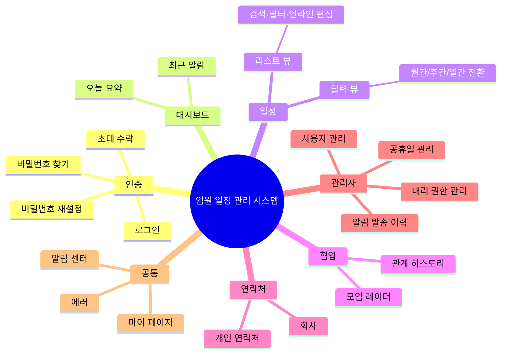
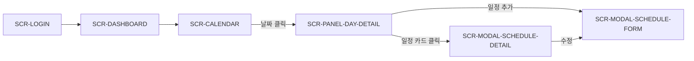
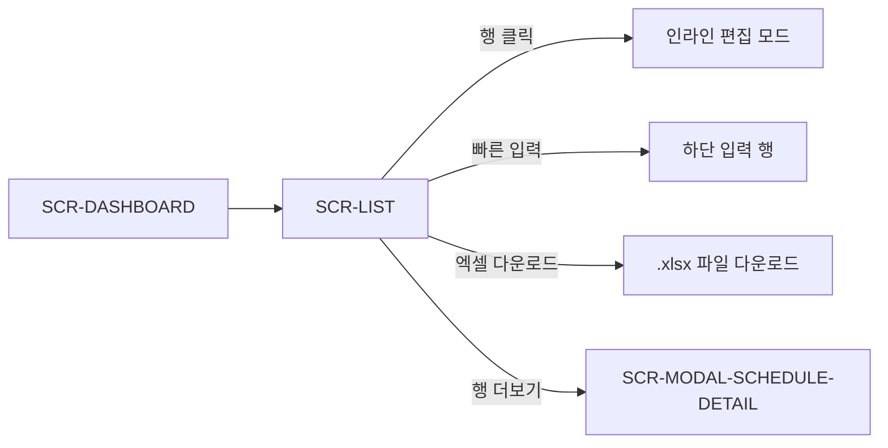
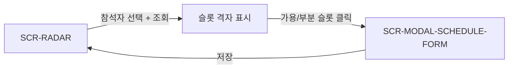
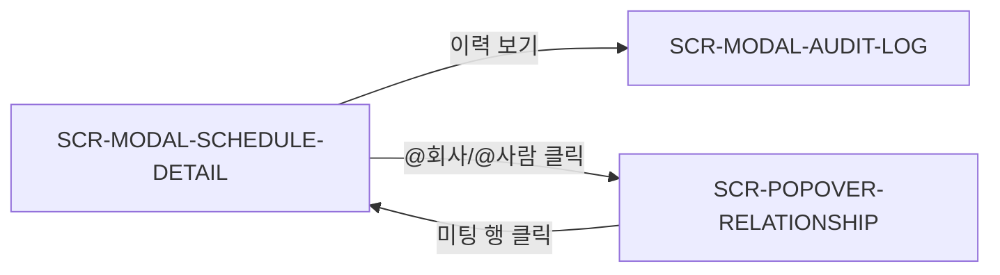

# 임원 일정 관리 시스템 — 정보구조도 (IA)

본 문서는 임원 일정 관리 시스템의 화면 계층, 메뉴 구조, 권한별 접근 범위, 화면 간 이동 흐름, 글로벌 네비게이션, URL 정책을 정의한다. 화면 식별자(SCR-*)는 동반 문서 [`screen_list.md`](./screen_list.md) 와 1:1로 대응한다.

---

## 1. 사이트맵

전체 화면 계층을 depth 3 이내로 표현한다. 모달/패널/팝오버는 본 사이트맵에서 제외하고 별도 그룹표·인벤토리에서 식별한다.

---

## 2. 메뉴 구조표

| Depth 1 | Depth 2 | Depth 3 | 화면 ID | 설명 | 접근 권한 |
|---|---|---|---|---|---|
| 인증 | 로그인 | — | SCR-LOGIN | 이메일+비밀번호 또는 사번+비밀번호로 로그인 | 미인증 |
| 인증 | 비밀번호 찾기 | — | SCR-PASSWORD-FIND | 등록 이메일로 재설정 링크 발송 요청 | 미인증 |
| 인증 | 비밀번호 재설정 | — | SCR-PASSWORD-RESET | 메일 링크 진입 후 새 비밀번호 설정 | 미인증 (토큰 보유) |
| 인증 | 초대 수락 | — | SCR-INVITE-ACCEPT | 초대 링크 진입 후 비밀번호 설정 및 계정 활성화 | 미인증 (토큰 보유) |
| 대시보드 | — | — | SCR-DASHBOARD | 로그인 직후 진입 화면. 오늘 일정 요약·최근 알림 | 일반 임원, 관리자 |
| 일정 | 달력 | — | SCR-CALENDAR | 월/주/일 뷰 토글, 임원 색상 레이어, 공통/공휴일 표시 | 일반 임원, 관리자 |
| 일정 | 리스트 | — | SCR-LIST | 테이블 조회·검색·필터·인라인 편집·엑셀 다운로드 | 일반 임원, 관리자 |
| 협업 | 모임 레이더 | — | SCR-RADAR | 참석자 선택 → 충돌 계산 → 가능 슬롯 표시 | 일반 임원, 관리자 |
| 협업 | 관계 히스토리 | — | SCR-POPOVER-RELATIONSHIP | @회사/@사람 클릭 시 미팅 이력 카드 (팝오버/바텀시트) | 일반 임원, 관리자 |
| 연락처 | 개인 연락처 | — | SCR-CONTACT | 연락처 목록·검색. 조회는 전체, CRUD는 관리자 | 관리자 (조회는 일반 임원도 가능) |
| 연락처 | 회사 | — | SCR-CONTACT-COMPANY | 회사·별칭 관리. CON-005 화면. 연락처와 동일 화면군 내 탭 | 관리자 (조회는 일반 임원도 가능) |
| 관리자 | 사용자 관리 | 사용자 초대 | SCR-ADMIN-USER | 사용자 목록·초대·역할 변경·활성화 토글 | 관리자 |
| 관리자 | 대리 권한 관리 | — | SCR-ADMIN-PROXY | 대리 입력 권한 부여·해제 목록 | 관리자 |
| 관리자 | 공휴일 관리 | — | SCR-ADMIN-HOLIDAY | 법정/대체/임시 공휴일 목록·임시 공휴일 등록·삭제 | 관리자 |
| 관리자 | 알림 발송 이력 | — | SCR-ADMIN-NOTIFICATION-LOG | NOT-001~003 발송 결과 이력 조회 | 관리자 |
| 공통 | 마이 페이지 | — | SCR-MY | 본인 프로필·비밀번호 변경·로그아웃 | 일반 임원, 관리자 |
| 공통 | 알림 센터 | — | SCR-NOTIFICATION | 인앱 알림 전체 목록 (벨 아이콘 드롭다운 + 전체 페이지) | 일반 임원, 관리자 |
| 공통 | 에러 | 권한 없음 | SCR-ERROR-403 | 권한 없는 화면 직접 접근 시 (대시보드 자동 이동 외 명시 화면 필요 시) | 모두 |
| 공통 | 에러 | 페이지 없음 | SCR-ERROR-404 | 존재하지 않는 경로 접근 시 | 모두 |

> **모달/패널/팝오버 화면**은 사이트맵 계층과 무관하게 호출된다. [3.6 모달·패널·팝오버 화면군](#36-모달패널팝오버-화면군) 참조.

---

## 3. 화면 그룹별 분류

### 3.1 인증 화면군

| 화면 ID | 화면명 | 핵심 기능 ID | Phase |
|---|---|---|---|
| SCR-LOGIN | 로그인 | AUTH-002, AUTH-004 | 1 |
| SCR-PASSWORD-FIND | 비밀번호 찾기 (이메일 입력) | AUTH-003 (1단계), NOT-005 | 1 |
| SCR-PASSWORD-RESET | 비밀번호 재설정 (새 비밀번호 입력) | AUTH-003 (2단계) | 1 |
| SCR-INVITE-ACCEPT | 초대 수락 (비밀번호 설정) | AUTH-001 (후반부) | 1 |

### 3.2 대시보드/일정 화면군

| 화면 ID | 화면명 | 핵심 기능 ID | Phase |
|---|---|---|---|
| SCR-DASHBOARD | 대시보드 | — (요약 표시 전용) | 1 |
| SCR-CALENDAR | 달력 뷰 (월/주/일 통합) | CAL-001~009 | 1 |
| SCR-LIST | 리스트 뷰 | LIS-001~007, EXP-001 | 1 |
| SCR-PANEL-DAY-DETAIL | 날짜 상세 펼침 패널 | CAL-007 | 1 |
| SCR-MODAL-SCHEDULE-FORM | 일정 등록·수정 폼 (개인/공통 통합) | SCH-001, SCH-003, COM-001, COM-003, SCH-006 | 1 |
| SCR-MODAL-SCHEDULE-DETAIL | 일정 상세 모달 | SCH-005, COM-002, COM-004 | 1 |

### 3.3 협업 도구 화면군

| 화면 ID | 화면명 | 핵심 기능 ID | Phase |
|---|---|---|---|
| SCR-RADAR | 모임 레이더 | RAD-001~004 | 3 |
| SCR-POPOVER-RELATIONSHIP | 관계 히스토리 카드 (모바일은 바텀시트) | REL-001~003 | 3 |

### 3.4 관리자 화면군

| 화면 ID | 화면명 | 핵심 기능 ID | Phase |
|---|---|---|---|
| SCR-ADMIN-USER | 사용자 관리 | AUTH-001, PERM-001 | 1 |
| SCR-ADMIN-PROXY | 대리권한 관리 | PERM-002 | 2 |
| SCR-ADMIN-HOLIDAY | 공휴일 관리 | HOL-001~004 | 2 |
| SCR-ADMIN-NOTIFICATION-LOG | 알림 발송 이력 | NOT-006 | 2 |
| SCR-CONTACT | 연락처 관리 (개인) | CON-001~004, MEN-002 | 2 |
| SCR-CONTACT-COMPANY | 회사 관리 (회사명·별칭) | CON-005 | 2 |

> 연락처(SCR-CONTACT, SCR-CONTACT-COMPANY)는 위치상 "관리자" 메뉴 그룹에 속하지 않는 별도 메뉴(연락처)이지만, CRUD 권한 측면에서 관리자 화면군과 함께 분류한다. 조회(CON-004)는 일반 임원도 가능하다.

### 3.5 공통 화면군

| 화면 ID | 화면명 | 핵심 기능 ID | Phase |
|---|---|---|---|
| SCR-MY | 마이 페이지 | AUTH-004 (로그아웃, 비밀번호 변경) | 1 |
| SCR-NOTIFICATION | 알림 센터 (벨 + 전체 목록) | NOT-001~005 (수신측 표시) | 2 |
| SCR-ERROR-403 | 권한 없음 | PERM-001, PERM-004 | 1 |
| SCR-ERROR-404 | 페이지 없음 | — | 1 |

> 일정 이력(AUD-001~004)은 독립된 화면이 아니라 일정 상세 모달의 하위 탭으로 노출되므로 본 그룹이 아닌 모달·패널 그룹의 SCR-MODAL-AUDIT-LOG로 식별한다 (3.6 참조). 알림 발송 이력(NOT-006)은 관리자 화면군의 SCR-ADMIN-NOTIFICATION-LOG로 별도 식별된다.

### 3.6 모달·패널·팝오버 화면군

사이트맵 계층에 종속되지 않으나 별도 화면 ID를 부여하여 인벤토리·매트릭스에서 식별한다.

| 화면 ID | 화면명 | 호출 위치 | 핵심 기능 ID | Phase |
|---|---|---|---|---|
| SCR-PANEL-DAY-DETAIL | 날짜 상세 펼침 패널 | SCR-CALENDAR (월간 뷰에서 날짜 클릭) | CAL-007 | 1 |
| SCR-MODAL-SCHEDULE-FORM | 일정 등록·수정 폼 모달 | SCR-CALENDAR, SCR-LIST, SCR-RADAR (슬롯 선택) | SCH-001, SCH-003, COM-001, COM-003, SCH-006, RAD-004 | 1 |
| SCR-MODAL-SCHEDULE-DETAIL | 일정 상세 모달 | SCR-CALENDAR, SCR-LIST, SCR-NOTIFICATION (알림 클릭) | SCH-005, COM-002, COM-004 | 1 |
| SCR-MODAL-AUDIT-LOG | 일정 이력 모달 | SCR-MODAL-SCHEDULE-DETAIL ("이력 보기" 탭) | AUD-001~004 | 3 |
| SCR-POPOVER-RELATIONSHIP | 관계 히스토리 카드 | SCR-LIST, SCR-MODAL-SCHEDULE-DETAIL, SCR-MODAL-SCHEDULE-FORM | REL-001~003 | 3 |
| SCR-MODAL-MENTION-NEW-CONTACT | 새 연락처 자동 등록 미니 다이얼로그 | SCR-MODAL-SCHEDULE-FORM (멘션 입력 중) | MEN-001, MEN-002 | 2 |
| SCR-MODAL-CONFIRM-DELETE | 일정/공휴일/연락처 삭제 확인 모달 | SCR-MODAL-SCHEDULE-DETAIL, SCR-ADMIN-HOLIDAY, SCR-CONTACT | SCH-004, HOL-003, CON-003, COM-004 | 1 |

---

## 4. 권한별 접근 가능 화면 매트릭스

권한 분류는 "미인증 / 일반 임원 / 관리자" 3분류로 정의한다. 대리 입력 권한(PROXY)은 별도 역할이 아닌 일반 임원에게 부여되는 추가 권한이며, 화면 노출 여부 자체는 일반 임원과 동일하므로 별도 컬럼으로 분리하지 않는다.

| 화면 ID | 화면명 | 미인증 | 일반 임원 | 관리자 |
|---|---|:---:|:---:|:---:|
| SCR-LOGIN | 로그인 | O | (자동 대시보드 이동) | (자동 대시보드 이동) |
| SCR-PASSWORD-FIND | 비밀번호 찾기 | O | O | O |
| SCR-PASSWORD-RESET | 비밀번호 재설정 | O (토큰) | O (토큰) | O (토큰) |
| SCR-INVITE-ACCEPT | 초대 수락 | O (토큰) | — | — |
| SCR-DASHBOARD | 대시보드 | X | O | O |
| SCR-CALENDAR | 달력 뷰 | X | O | O |
| SCR-LIST | 리스트 뷰 | X | O | O |
| SCR-RADAR | 모임 레이더 | X | O | O |
| SCR-CONTACT | 연락처 (개인) | X | O (조회) | O (CRUD) |
| SCR-CONTACT-COMPANY | 회사 | X | O (조회) | O (CRUD) |
| SCR-ADMIN-USER | 사용자 관리 | X | X | O |
| SCR-ADMIN-PROXY | 대리권한 관리 | X | X | O |
| SCR-ADMIN-HOLIDAY | 공휴일 관리 | X | X | O |
| SCR-ADMIN-NOTIFICATION-LOG | 알림 발송 이력 | X | X | O |
| SCR-MY | 마이 페이지 | X | O | O |
| SCR-NOTIFICATION | 알림 센터 | X | O | O |
| SCR-ERROR-403 | 권한 없음 | O | O | O |
| SCR-ERROR-404 | 페이지 없음 | O | O | O |
| SCR-PANEL-DAY-DETAIL | 날짜 상세 패널 | X | O | O |
| SCR-MODAL-SCHEDULE-FORM | 일정 등록·수정 폼 | X | O (개인: 본인/대리 권한 임원만 · 공통: 모든 인증 사용자) | O (전체 임원, 공통 일정 포함) |
| SCR-MODAL-SCHEDULE-DETAIL | 일정 상세 모달 | X | O | O |
| SCR-MODAL-AUDIT-LOG | 일정 이력 모달 | X | O (본인 일정만) | O (전체) |
| SCR-POPOVER-RELATIONSHIP | 관계 히스토리 카드 | X | O | O |
| SCR-MODAL-MENTION-NEW-CONTACT | 새 연락처 자동 등록 | X | O | O |
| SCR-MODAL-CONFIRM-DELETE | 삭제 확인 모달 | X | O (권한 범위 내) | O |

> 대리 입력 권한 보유자는 SCR-MODAL-SCHEDULE-FORM 진입 시 폼 내부의 "입력 대상" 드롭다운에 권한이 부여된 임원이 노출된다 (PERM-004 참조). 화면 노출 여부 자체에는 차이가 없다.

> SCR-CONTACT, SCR-CONTACT-COMPANY는 사이드바 메뉴 노출 정책상 PERM-004에서 "관리자만"으로 정의되어 있으나, CON-004 조회 기능 자체는 모든 인증 사용자가 사용 가능하다. 본 매트릭스는 더 엄격한 정책(관리자 전용 노출)을 따르되, 일반 임원이 직접 URL 접근 또는 멘션 칩 클릭 등 진입 경로로 들어오면 조회 전용으로 표시한다.

---

## 5. 화면 간 주요 이동 경로

핵심 사용자 흐름을 4가지로 한정하여 표현한다.

### 5.1 로그인부터 일정 등록까지

### 5.2 리스트 뷰에서 인라인 편집과 엑셀 다운로드

### 5.3 모임 레이더에서 일정 등록까지

### 5.4 일정 상세에서 이력 및 관계 히스토리 진입

---

## 6. 글로벌 네비게이션 구조

### 6.1 상단 GNB (데스크탑)

좌측 로고 영역과 우측 사용자 영역으로 구성한다. 메뉴 항목은 사이드 LNB로 위임한다.

| 영역 | 항목 | 동작 |
|---|---|---|
| 좌측 | 로고 | 클릭 시 SCR-DASHBOARD 이동 |
| 좌측 | 사이드바 토글 | LNB 펼치기/접기 |
| 중앙 | 통합 검색 (선택) | 일정/연락처 통합 검색 (Phase 2 이후 검토) |
| 우측 | 알림 벨 | SCR-NOTIFICATION 드롭다운 (전체 목록은 별도 페이지) |
| 우측 | 사용자 아바타 | 드롭다운: 마이 페이지(SCR-MY), 로그아웃 |

### 6.2 사이드 LNB (데스크탑/태블릿)

권한별 노출 차이를 다음과 같이 둔다.

| 메뉴 그룹 | 항목 | 일반 임원 | 관리자 |
|---|---|:---:|:---:|
| 일정 | 대시보드 (SCR-DASHBOARD) | O | O |
| 일정 | 달력 (SCR-CALENDAR) | O | O |
| 일정 | 리스트 (SCR-LIST) | O | O |
| 협업 | 모임 레이더 (SCR-RADAR) | O | O |
| 데이터 | 연락처 (SCR-CONTACT) | X (메뉴 미노출, 진입은 가능) | O |
| 관리자 | 사용자 관리 (SCR-ADMIN-USER) | X | O |
| 관리자 | 대리권한 관리 (SCR-ADMIN-PROXY) | X | O |
| 관리자 | 공휴일 관리 (SCR-ADMIN-HOLIDAY) | X | O |
| 관리자 | 알림 발송 이력 (SCR-ADMIN-NOTIFICATION-LOG) | X | O |

> 관리자 메뉴 그룹 전체가 일반 임원에게는 미노출된다 (PERM-004).

### 6.3 모바일 하단 탭 바

핵심 4~5개 항목으로 한정한다.

| 위치 | 항목 | 화면 ID | 비고 |
|---|---|---|---|
| 1 | 대시보드 | SCR-DASHBOARD | 홈 |
| 2 | 달력 | SCR-CALENDAR | 기본 보조 뷰 |
| 3 | 리스트 | SCR-LIST | 검색·필터 진입 |
| 4 | 알림 | SCR-NOTIFICATION | 미확인 카운트 배지 |
| 5 | 더보기 | (드로어) | 마이 페이지·연락처·관리자 메뉴·로그아웃 |

> 모임 레이더, 관리자 화면은 "더보기" 드로어를 통해 진입한다. 모바일에서 관리자 메뉴는 권한 보유자에게만 드로어 내에서 노출된다.

---

## 7. URL 정책 (논리 경로)

페이지 라우트 설계 시 참고할 논리 경로 패턴을 정의한다. 모든 경로는 한국어로 통일한다. 실제 구현 경로(영문 슬러그 사용 여부 등)는 개발 단계에서 결정한다.

| 화면군 | 논리 경로 패턴 | 예시 |
|---|---|---|
| 인증 | `/로그인` | `/로그인` |
| 인증 | `/비밀번호-찾기` | `/비밀번호-찾기` |
| 인증 | `/비밀번호-재설정?token={token}` | `/비밀번호-재설정?token=abc123` |
| 인증 | `/초대-수락?token={token}` | `/초대-수락?token=xyz789` |
| 대시보드 | `/대시보드` | `/대시보드` |
| 일정 | `/달력` | `/달력` |
| 일정 | `/달력?뷰={월\|주\|일}&날짜={YYYY-MM-DD}` | `/달력?뷰=주&날짜=2026-05-11` |
| 일정 | `/리스트` | `/리스트` |
| 일정 | `/리스트?시작={YYYY-MM-DD}&종료={YYYY-MM-DD}&담당자={임원ID}` | `/리스트?시작=2026-05-01&종료=2026-05-31` |
| 협업 | `/레이더` | `/레이더` |
| 데이터 | `/연락처` | `/연락처` |
| 데이터 | `/연락처/회사` | `/연락처/회사` |
| 관리자 | `/관리/사용자` | `/관리/사용자` |
| 관리자 | `/관리/대리권한` | `/관리/대리권한` |
| 관리자 | `/관리/공휴일` | `/관리/공휴일` |
| 관리자 | `/관리/알림이력` | `/관리/알림이력` |
| 공통 | `/마이` | `/마이` |
| 공통 | `/알림` | `/알림` |
| 에러 | `/오류/권한없음` | `/오류/권한없음` |
| 에러 | `/오류/페이지없음` | `/오류/페이지없음` |

### 모달·패널 경로 정책

모달과 사이드 패널은 일반적으로 부모 화면의 URL을 유지한 채 오버레이로 표시한다. 단, 일정 상세는 딥링크 공유를 위해 query param 또는 path를 부여한다.

| 모달/패널 | 경로 정책 | 예시 |
|---|---|---|
| SCR-PANEL-DAY-DETAIL | 부모 URL 유지 + query | `/달력?날짜=2026-05-11` |
| SCR-MODAL-SCHEDULE-DETAIL | 딥링크 지원 | `/달력?일정={일정ID}` 또는 `/일정/{일정ID}` |
| SCR-MODAL-SCHEDULE-FORM | 부모 URL 유지 (오버레이) | — |
| SCR-MODAL-AUDIT-LOG | 일정 상세 모달 내부 탭 | `/일정/{일정ID}?탭=이력` |
| SCR-POPOVER-RELATIONSHIP | 부모 URL 유지 (오버레이) | — |

---
