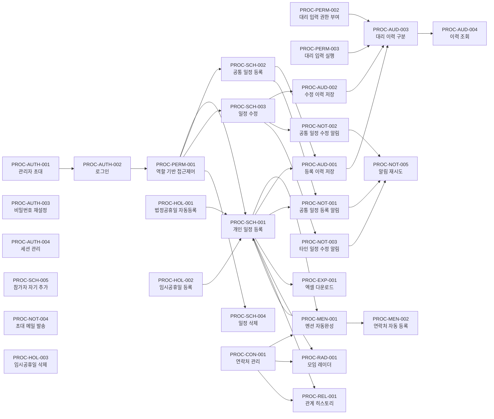
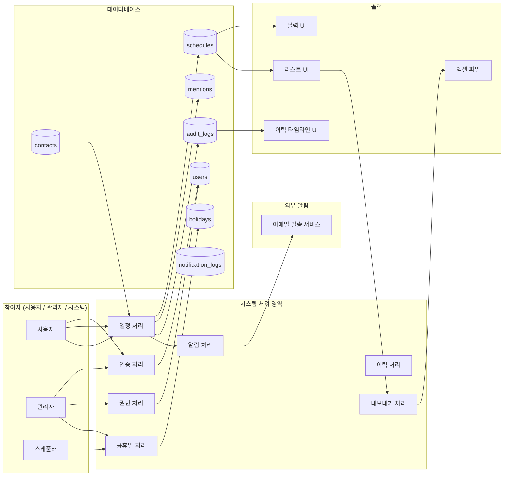

# 프로세스 문서 인덱스

**관련 화면 명세**: [spec/00_overview.md](../spec/00_overview.md)

임원 일정 관리 시스템의 전체 프로세스 정의 문서 목록 및 연관 관계를 정리한 인덱스 파일이다.

---

## 1. 전체 프로세스 목록

| 프로세스 ID | 프로세스명 | 파일 | Phase | 참여자 요약 |
|---|---|---|:---:|---|
| PROC-AUTH-001 | 관리자 초대 프로세스 | proc_01_auth.md | 인증 | 관리자, 피초대자, 인증 서비스, 이메일 발송 서비스 |
| PROC-AUTH-002 | 로그인 프로세스 | proc_01_auth.md | 인증 | 사용자, 인증 서비스 |
| PROC-AUTH-003 | 비밀번호 재설정 프로세스 | proc_01_auth.md | 인증 | 사용자, 인증 서비스 |
| PROC-AUTH-004 | 세션 관리 프로세스 | proc_01_auth.md | 인증 | 사용자, 미들웨어, 인증 서비스 |
| PROC-PERM-001 | 역할 기반 접근 제어 프로세스 | proc_02_permission.md | 권한 | 사용자, 미들웨어, 비즈니스 로직 계층, 데이터 접근 제어 계층 |
| PROC-PERM-002 | 대리 입력 권한 부여 프로세스 | proc_02_permission.md | 권한 | 관리자, 피권한자, 권한 대상 임원 |
| PROC-PERM-003 | 대리 입력 실행 프로세스 | proc_02_permission.md | 권한 | 대리 입력자, 일정 주인 |
| PROC-SCH-001 | 개인 일정 등록 프로세스 | proc_03_schedule.md | 일정 관리 | 임원, 시스템 |
| PROC-SCH-002 | 공통 일정 등록 프로세스 | proc_03_schedule.md | 일정 관리 | 임원/관리자, 전체 임원, 시스템 |
| PROC-SCH-003 | 일정 수정 프로세스 | proc_03_schedule.md | 일정 관리 | 임원(본인)/관리자, 시스템 |
| PROC-SCH-004 | 일정 삭제 프로세스 | proc_03_schedule.md | 일정 관리 | 임원(본인)/관리자, 시스템 |
| PROC-SCH-005 | 공통 일정 참가자 자기 추가 프로세스 | proc_03_schedule.md | 일정 관리 | 임원, 시스템 |
| PROC-MEN-001 | @멘션 자동완성 프로세스 | proc_04_mention_contact.md | 멘션 | 임원, 에디터, 시스템 |
| PROC-MEN-002 | 새 연락처 자동 등록 프로세스 | proc_04_mention_contact.md | 멘션 | 임원, 시스템, 관리자 |
| PROC-CON-001 | 연락처 CRUD 프로세스 | proc_04_mention_contact.md | 연락처 | 관리자, 시스템 |
| PROC-NOT-001 | 공통 일정 등록 알림 프로세스 | proc_05_notification.md | 알림 | 시스템, 알림 처리 서비스, 이메일 발송 서비스 |
| PROC-NOT-002 | 공통 일정 수정 알림 프로세스 | proc_05_notification.md | 알림 | 시스템, 알림 처리 서비스, 이메일 발송 서비스 |
| PROC-NOT-003 | 타인 일정 수정 알림 프로세스 | proc_05_notification.md | 알림 | 시스템, 알림 처리 서비스, 이메일 발송 서비스 |
| PROC-NOT-004 | 초대 메일 발송 프로세스 | proc_05_notification.md | 알림 | 관리자, 시스템, 인증 서비스 |
| PROC-NOT-005 | 알림 실패 재시도 프로세스 | proc_05_notification.md | 알림 | 알림 처리 서비스, 관리자 |
| PROC-RAD-001 | 모임 레이더 조회 프로세스 | proc_06_meeting_radar.md | 레이더 | 사용자, 시스템 |
| PROC-REL-001 | 관계 히스토리 조회 프로세스 | proc_07_relationship_history.md | 레이더 | 사용자, 시스템 |
| PROC-HOL-001 | 연간 법정 공휴일 자동 등록 프로세스 | proc_08_holiday.md | 공휴일 | 스케줄러, 시스템, 공공데이터포털 |
| PROC-HOL-002 | 임시 공휴일 수동 등록 프로세스 | proc_08_holiday.md | 공휴일 | 관리자, 시스템 |
| PROC-HOL-003 | 임시 공휴일 삭제 프로세스 | proc_08_holiday.md | 공휴일 | 관리자, 시스템 |
| PROC-AUD-001 | 일정 등록 이력 저장 프로세스 | proc_09_audit_log.md | 이력 | 사용자, 시스템 |
| PROC-AUD-002 | 일정 수정 이력 저장 프로세스 | proc_09_audit_log.md | 이력 | 사용자, 시스템 |
| PROC-AUD-003 | 대리 입력 이력 구분 저장 프로세스 | proc_09_audit_log.md | 이력 | 대리 입력자, 임원, 시스템 |
| PROC-AUD-004 | 이력 조회 프로세스 | proc_09_audit_log.md | 이력 | 관리자/임원, 시스템 |
| PROC-EXP-001 | 엑셀 다운로드 프로세스 | proc_10_export.md | 내보내기 | 사용자, 시스템 |

---

## 2. 프로세스 간 연관 관계 다이어그램

---

## 3. 데이터 흐름 개요

---

## 4. Phase별 프로세스 분류

| Phase | 설명 | 포함 프로세스 수 | 주요 프로세스 ID |
|---|---|:---:|---|
| **인증** | 사용자 계정 생성·로그인·로그아웃·세션 관리 | 4 | PROC-AUTH-001 ~ 004 |
| **권한/대리입력** | 역할 기반 접근 제어 및 대리 입력 권한 관리·실행 | 3 | PROC-PERM-001 ~ 003 |
| **일정 관리** | 임원 개인·공통 일정 등록·수정·삭제·참가 | 5 | PROC-SCH-001 ~ 005 |
| **멘션** | 일정 내 @멘션 자동완성·연락처 자동 등록 | 2 | PROC-MEN-001 ~ 002 |
| **연락처** | 파트너·인물 연락처 관리 | 1 | PROC-CON-001 |
| **알림** | 이메일 알림 및 재시도 | 5 | PROC-NOT-001 ~ 005 |
| **레이더/관계** | 모임 레이더 및 관계 히스토리 조회 | 2 | PROC-RAD-001, PROC-REL-001 |
| **공휴일** | 법정·임시 공휴일 등록·삭제 | 3 | PROC-HOL-001 ~ 003 |
| **이력** | 일정 변경 이력 저장·조회 | 4 | PROC-AUD-001 ~ 004 |
| **내보내기** | 엑셀 다운로드 | 1 | PROC-EXP-001 |
| **합계** | | **30** | |

---

## 5. 핵심 테이블 — 프로세스 매핑

| 테이블 | 주요 연관 프로세스 |
|---|---|
| `users` | AUTH-001~004, PERM-001~003, AUD-003 |
| `schedules` | SCH-001~005, AUD-001~002, NOT-001~004, EXP-001 |
| `audit_logs` | AUD-001~004 |
| `holidays` | HOL-001~003 |
| `mentions` | MEN-001~002, SCH-001, EXP-001 |
| `proxy_permissions` | PERM-002~003, AUD-003 |
| `contacts` | CON-001, RAD-001, REL-001 |
| `companies` | CON-001, MEN-001~002, REL-001 |
| `notification_logs` | NOT-001~005 |
| `schedule_participants` | SCH-002, SCH-005 |

---

## 6. 문서 파일 목록

| 파일명 | 제목 | 포함 프로세스 수 |
|---|---|:---:|
| `proc_00_index.md` | 프로세스 문서 인덱스 (현재 파일) | — |
| `proc_01_auth.md` | 인증 프로세스 정의서 | 4 |
| `proc_02_permission.md` | 권한/대리입력 프로세스 정의서 | 3 |
| `proc_03_schedule.md` | 일정 관리 프로세스 정의서 | 5 |
| `proc_04_mention_contact.md` | 멘션 및 연락처 프로세스 정의서 | 3 |
| `proc_05_notification.md` | 알림 프로세스 정의서 | 5 |
| `proc_06_meeting_radar.md` | 모임 레이더 프로세스 정의서 | 1 |
| `proc_07_relationship_history.md` | 관계 히스토리 프로세스 정의서 | 1 |
| `proc_08_holiday.md` | 공휴일 관리 프로세스 정의서 | 3 |
| `proc_09_audit_log.md` | 이력 저장 프로세스 정의서 | 4 |
| `proc_10_export.md` | 엑셀 내보내기 프로세스 정의서 | 1 |
