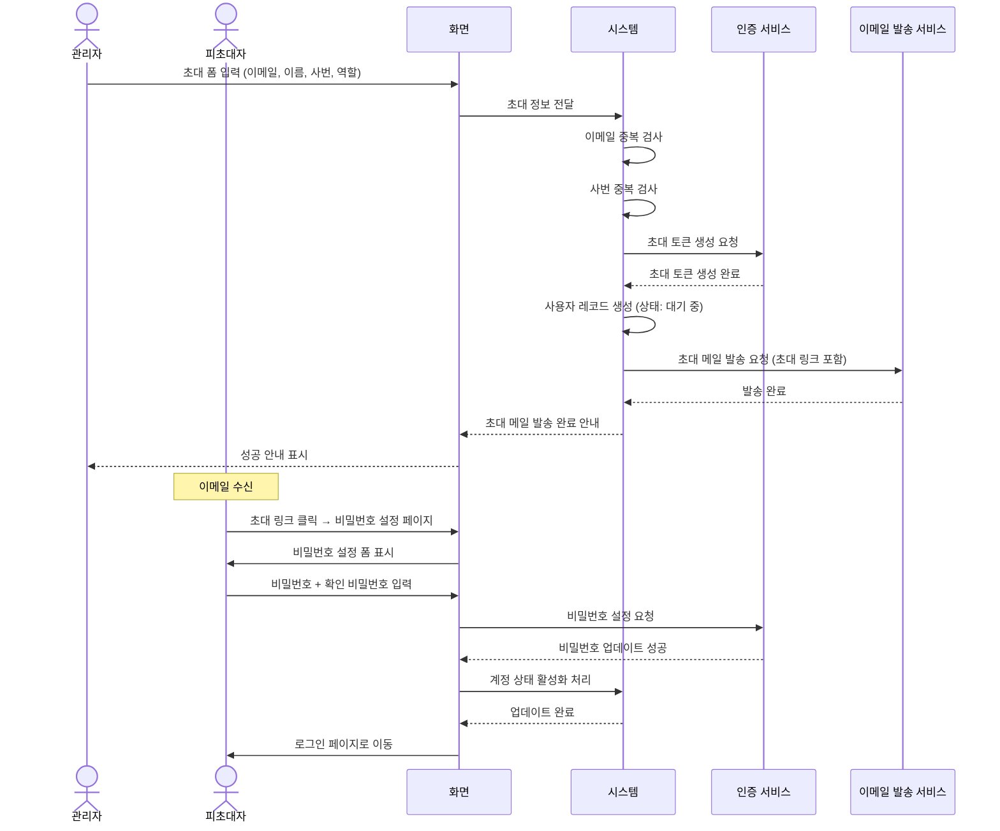
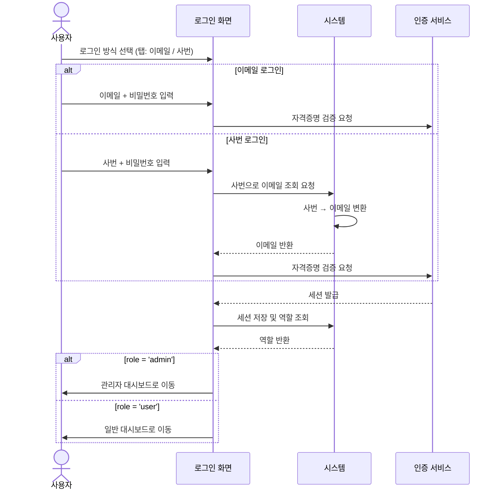
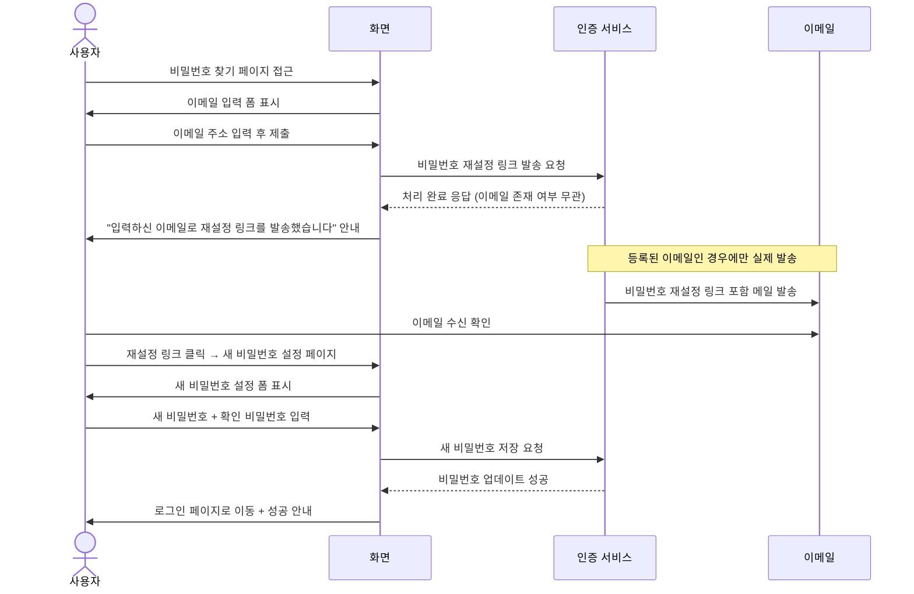
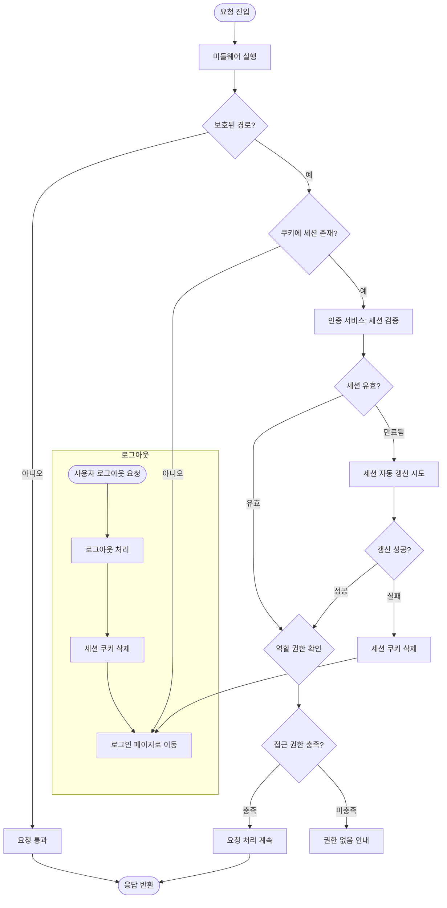

# 인증 프로세스 정의서

**관련 화면 명세**: [spec/01_auth.md](../spec/01_auth.md)

---

## PROC-AUTH-001: 관리자 초대 프로세스

### 개요

관리자가 신규 사용자를 시스템에 초대하고, 피초대자가 비밀번호를 설정하여 계정을 활성화하는 전체 온보딩 흐름을 정의한다. 이메일 기반 초대 링크를 통해 인증하며, 계정은 비밀번호 설정 완료 시점에 활성화된다.

### 참여자 (Actor)

| 구분 | 설명 |
|---|---|
| 관리자 | 초대 권한을 보유한 시스템 관리자 (role = admin) |
| 피초대자 | 초대를 받아 계정을 생성하는 신규 사용자 |
| 인증 서비스 | 초대 토큰 생성 및 사용자 인증 처리 |
| 이메일 발송 서비스 | 커스텀 초대 이메일 발송 |

### 사전 조건

- 관리자가 로그인 상태이며 `role = admin` 권한을 보유하고 있어야 한다.
- 초대할 이메일 주소 및 사번이 `users` 테이블에 존재하지 않아야 한다.
- 이메일 발송 서비스가 배포·활성화되어 있어야 한다.

### 트리거

관리자가 사용자 관리 페이지에서 "사용자 초대" 버튼을 클릭하고 초대 폼을 제출할 때.

### 메인 플로우

### 대안 플로우

**AF-001: 초대 메일 재발송**

1. 관리자가 사용자 목록에서 대기 중(status = 'pending') 사용자의 "재발송" 버튼 클릭.
2. 인증 서비스 재호출 → 새 토큰 발급 (기존 토큰 무효화).
3. 커스텀 초대 메일 재발송.
4. 관리자에게 재발송 완료 안내.

### 예외 플로우

| 예외 ID | 조건 | 처리 방식 |
|---|---|---|
| EX-001 | 이메일 중복 | 이메일 중복 안내, 폼에 오류 메시지 표시 |
| EX-002 | 사번 중복 | 사번 중복 안내, 폼에 오류 메시지 표시 |
| EX-003 | 초대 토큰 만료 (24시간 초과) | 비밀번호 설정 페이지 진입 시 만료 안내 페이지 표시, "재초대 요청" 링크 제공 |
| EX-004 | 이메일 발송 실패 | 관리자에게 발송 실패 안내, 사용자 레코드 롤백 (생성된 레코드 삭제) |
| EX-005 | 비밀번호 정책 미충족 | 클라이언트 유효성 검사 후 안내 (최소 10자, 영문·숫자·특수문자 각 1자 이상 조합 — NFR-SEC-004 기준) |

### 사후 조건

- `users` 테이블에 신규 사용자 레코드가 존재하며 `status = 'active'`
- 인증 서비스에 해당 이메일 계정이 활성화 상태로 등록됨
- 피초대자가 로그인 가능한 상태

### 연관 테이블

| 구분 | 항목 |
|---|---|
| 테이블 | `users` (email, name, employee_id, role, status) |

---

## PROC-AUTH-002: 로그인 프로세스

### 개요

사용자가 이메일 또는 사번을 이용해 시스템에 로그인하는 프로세스를 정의한다. 두 가지 로그인 방식을 지원하며, 사번 방식은 서버에서 이메일로 변환 후 인증 서비스에서 처리한다. 인증 성공 시 역할에 따라 적절한 페이지로 이동한다.

### 참여자 (Actor)

| 구분 | 설명 |
|---|---|
| 사용자 | 시스템에 접근하려는 등록된 사용자 |
| 시스템 | 인증 처리 및 역할 기반 이동 처리 |
| 인증 서비스 | 세션 발급 및 자격증명 검증 |

### 사전 조건

- 사용자 계정이 `users` 테이블에 존재하고 `status = 'active'` 상태여야 한다.
- 사용자가 비밀번호 설정을 완료한 상태여야 한다.

### 트리거

사용자가 로그인 페이지에 접근하여 로그인 폼을 제출할 때.

### 메인 플로우

### 대안 플로우

**AF-001: 이미 로그인된 상태에서 로그인 페이지 접근**

1. 미들웨어에서 유효한 세션 감지.
2. 로그인 페이지 접근 시 역할에 따라 대시보드로 자동 이동.

### 예외 플로우

| 예외 ID | 조건 | 처리 방식 |
|---|---|---|
| EX-001 | 잘못된 자격증명 (이메일/비밀번호 불일치) | "이메일 또는 비밀번호가 올바르지 않습니다" 오류 표시, 실패 횟수 카운트 |
| EX-002 | 5회 연속 로그인 실패 | 계정 잠금 (`status = 'locked'`), 관리자 해제 필요 안내 메시지 표시 |
| EX-003 | `status = 'pending'` 계정 | "계정이 아직 활성화되지 않았습니다. 초대 메일을 확인하세요." 안내 |
| EX-004 | `status = 'inactive'` 계정 | "비활성화된 계정입니다. 관리자에게 문의하세요." 안내 |
| EX-005 | 존재하지 않는 사번 | "등록되지 않은 사번입니다" 오류 표시 |
| EX-006 | 인증 서비스 장애 | 오류 페이지 표시 및 재시도 안내 |

### 사후 조건

- 유효한 세션 쿠키가 브라우저에 저장됨
- 사용자가 역할에 맞는 대시보드 페이지에 위치함
- `users` 테이블의 `last_login_at` 갱신 (선택적)

### 연관 테이블

| 구분 | 항목 |
|---|---|
| 테이블 | `users` (email, employee_id, role, status) |

---

## PROC-AUTH-003: 비밀번호 찾기 프로세스

### 개요

사용자가 비밀번호를 분실했을 때 이메일을 통해 재설정 링크를 수신하고 새 비밀번호를 설정하는 프로세스를 정의한다. 보안상 이메일 등록 여부와 무관하게 동일한 응답을 반환한다.

### 참여자 (Actor)

| 구분 | 설명 |
|---|---|
| 사용자 | 비밀번호를 분실한 등록 사용자 |
| 인증 서비스 | 재설정 토큰 생성 및 이메일 발송 처리 |

### 사전 조건

- 사용자가 로그아웃 상태여야 한다.
- 비밀번호 찾기 페이지에 접근 가능해야 한다.

### 트리거

사용자가 로그인 페이지에서 "비밀번호를 잊으셨나요?" 링크를 클릭할 때.

### 메인 플로우

### 대안 플로우

없음 (단일 경로 프로세스)

### 예외 플로우

| 예외 ID | 조건 | 처리 방식 |
|---|---|---|
| EX-001 | 미등록 이메일 | 보안상 동일 응답 반환 ("재설정 링크를 발송했습니다"), 실제 이메일은 미발송 |
| EX-002 | 재설정 토큰 만료 (1시간 초과) | 비밀번호 설정 페이지 진입 시 "링크가 만료되었습니다" 안내, 비밀번호 찾기 재시도 링크 제공 |
| EX-003 | 이미 사용된 토큰 | "이미 사용된 링크입니다" 안내, 재시도 링크 제공 |
| EX-004 | 비밀번호 정책 미충족 | 클라이언트 유효성 검사 후 안내 |

### 사후 조건

- 사용자의 비밀번호가 새 값으로 변경됨
- 기존 세션 전체 무효화 (보안 처리)
- 사용자가 로그인 페이지로 이동하여 새 비밀번호로 로그인 가능

### 연관 테이블

| 구분 | 항목 |
|---|---|
| 테이블 | `users` (이메일 존재 여부 확인) |

---

## PROC-AUTH-004: 세션 관리 프로세스

### 개요

사용자의 모든 요청에서 세션 유효성을 검증하고, 만료된 세션을 자동 갱신하거나 로그아웃 처리하는 프로세스를 정의한다. 미들웨어를 통해 페이지 및 API 요청 진입 시 일괄 처리된다.

### 참여자 (Actor)

| 구분 | 설명 |
|---|---|
| 사용자 | 시스템에 접근하는 모든 사용자 |
| 미들웨어 | 모든 요청의 진입점에서 세션 검증 수행 |
| 인증 서비스 | 세션 검증 및 갱신 처리 |

### 사전 조건

- 미들웨어가 보호된 경로에 적용되어 있어야 한다.
- 서버사이드 인증 클라이언트가 설정되어 있어야 한다.

### 트리거

사용자가 보호된 경로(대시보드, 관리자 페이지, 데이터 조회 등)에 요청을 보낼 때마다.

### 메인 플로우

### 대안 플로우

**AF-001: 복수 탭 세션 동기화**

1. 사용자가 한 탭에서 로그아웃.
2. 다른 탭에서 요청 발생 시 미들웨어가 세션 없음 감지.
3. 해당 탭도 로그인 페이지로 이동.

### 예외 플로우

| 예외 ID | 조건 | 처리 방식 |
|---|---|---|
| EX-001 | 갱신 토큰 만료 | 갱신 실패로 처리, 세션 삭제 후 로그인 페이지 이동 |
| EX-002 | 인증 서비스 장애 | 세션 검증 불가 → 보안 원칙에 따라 로그인 페이지 이동 |
| EX-003 | 역할 없는 사용자 접근 | 권한 없음 안내 페이지 표시 |
| EX-004 | 세션 위조 (토큰 변조) | 세션 검증 실패 → 세션 삭제 후 로그인 페이지 이동 |

### 사후 조건

- 유효한 세션 보유 사용자만 보호된 리소스에 접근 가능
- 만료된 세션은 자동으로 갱신되거나 강제 로그아웃 처리됨
- 로그아웃 시 브라우저의 세션 쿠키가 완전히 제거됨

### 연관 테이블

| 구분 | 항목 |
|---|---|
| 테이블 | `users` (역할, 상태 확인) |
