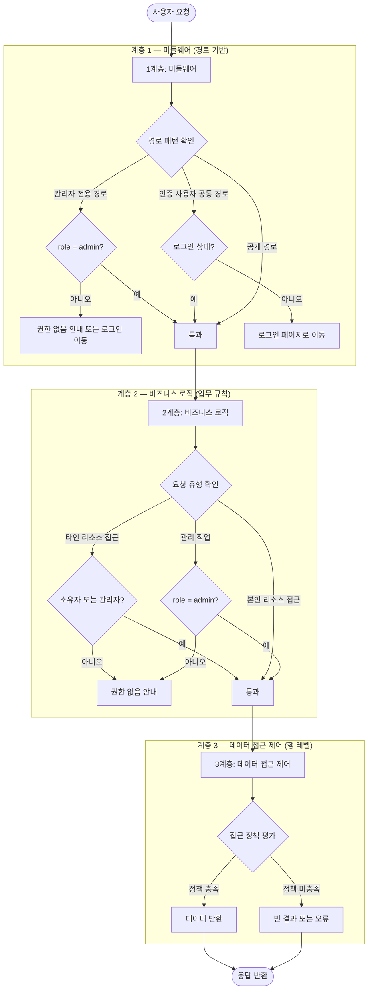
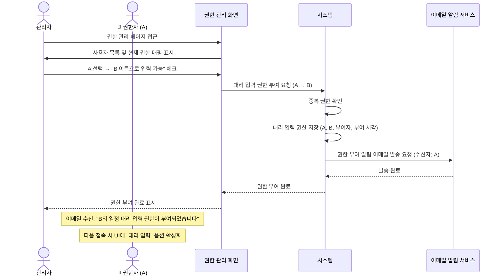
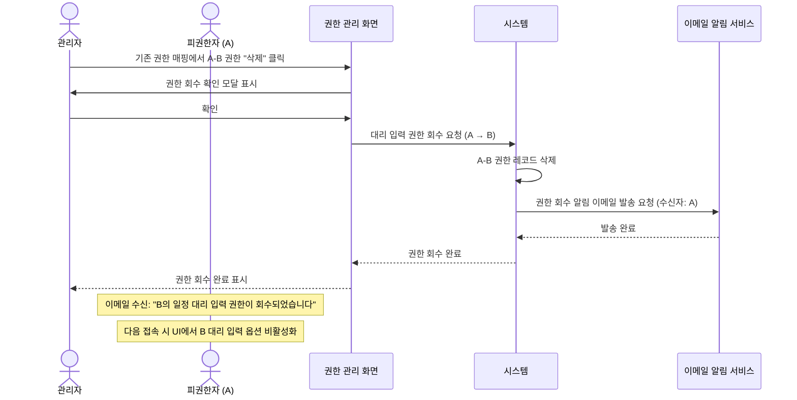
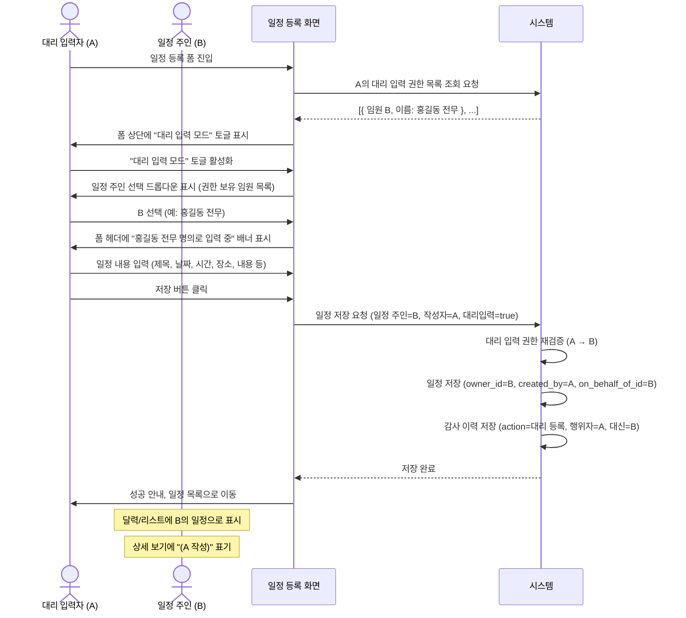

# 권한 및 대리 입력 프로세스 정의서

**관련 화면 명세**: [spec/02_permission.md](../spec/02_permission.md)

---

## PROC-PERM-001: 역할 기반 접근 제어 프로세스

### 개요

시스템의 모든 리소스 접근을 3계층(미들웨어 → 비즈니스 로직 → 데이터 레벨)으로 검증하는 역할 기반 접근 제어(RBAC) 프로세스를 정의한다. 각 계층은 독립적으로 동작하여 단일 계층 우회 시에도 다음 계층에서 차단이 이루어지는 심층 방어 구조를 형성한다.

### 참여자 (Actor)

| 구분 | 설명 |
|---|---|
| 사용자 | 시스템에 접근하는 모든 사용자 (admin / user) |
| 미들웨어 | 경로 패턴 기반 1차 접근 제어 |
| 비즈니스 로직 계층 | 업무 로직 레벨 2차 권한 검사 |
| 데이터 접근 제어 계층 | 행(row) 레벨 데이터 접근 제어 (3차) |

### 사전 조건

- 사용자가 로그인 상태이며 유효한 세션을 보유하고 있어야 한다.
- `users` 테이블의 `role` 필드가 `admin` 또는 `user`로 설정되어 있어야 한다.
- 데이터 접근 제어 정책이 각 테이블에 적용되어 있어야 한다.

### 트리거

사용자가 보호된 페이지 또는 기능에 요청을 보낼 때.

### 메인 플로우

### 역할별 접근 경로 매트릭스

| 기능 영역 | admin | user | 비고 |
|---|---|---|---|
| 관리자 전용 페이지 | 허용 | 거부 | 관리자 전용 |
| 관리자 전용 기능 | 허용 | 거부 | 관리자 전용 |
| 대시보드 | 허용 | 허용 | 인증 사용자 공통 |
| 일정 조회·등록·수정·삭제 | 허용 | 허용 (본인 일정) | 일정 관리 |
| 연락처 조회 | 허용 | 허용 | 읽기 전용 |
| 연락처 등록·수정·삭제 | 허용 | 거부 | 관리자만 |
| 인증 페이지 | 허용 | 허용 | 공개 경로 |

### 데이터 접근 정책 요약

| 테이블 | 작업 | 허용 조건 |
|---|---|---|
| `schedules` | 조회 | 소유자 본인 또는 관리자 |
| `schedules` | 등록 | 인증 사용자 (본인 명의) |
| `schedules` | 수정·삭제 | 소유자 본인 또는 관리자 |
| `users` | 조회 | 본인 또는 관리자 |
| `proxy_permissions` | 조회 | 권한 부여자, 권한 대상자, 또는 관리자 |
| `audit_logs` | 조회 | 관리자 전용 |

### 대안 플로우

없음 (단방향 검증 흐름)

### 예외 플로우

| 예외 ID | 조건 | 처리 방식 |
|---|---|---|
| EX-001 | 세션 만료 상태에서 보호 경로 접근 | PROC-AUTH-004 세션 관리 프로세스로 위임 |
| EX-002 | role 필드 누락 사용자 | 미들웨어에서 기본 'user' 권한으로 처리, 관리자 페이지 차단 |
| EX-003 | 비즈니스 로직과 데이터 계층 결과 불일치 | 데이터 접근 제어가 최종 권한자로 동작, 빈 결과 반환 |

### 사후 조건

- 권한 없는 요청은 모든 계층에서 차단되어 데이터 노출 없음
- 정상 요청은 최소 권한 원칙에 따라 필요한 데이터만 반환됨
- 모든 관리자 작업은 `audit_logs`에 기록됨

### 연관 테이블

| 구분 | 항목 |
|---|---|
| 테이블 | `users` (role 필드 기반 권한 판단) |
| 테이블 | `audit_logs` (관리자 작업 기록) |

---

## PROC-PERM-002: 대리 입력 권한 부여 프로세스

### 개요

관리자가 특정 사용자(A)에게 다른 사용자(B, 임원 등) 이름으로 일정을 입력할 수 있는 대리 입력 권한을 부여하고, 필요시 회수하는 프로세스를 정의한다. 권한 부여 및 회수 시 대상자에게 이메일 알림을 발송한다.

### 참여자 (Actor)

| 구분 | 설명 |
|---|---|
| 관리자 | 대리 입력 권한을 설정하는 시스템 관리자 |
| 피권한자 (A) | 대리 입력 권한을 받는 사용자 (비서, 담당자 등) |
| 권한 대상 (B) | A가 대신하여 일정을 입력할 임원 또는 사용자 |

### 사전 조건

- 관리자가 로그인 상태이며 `role = admin` 권한을 보유해야 한다.
- A와 B 모두 `users` 테이블에 `status = 'active'` 상태로 존재해야 한다.
- A-B 조합의 `proxy_permissions` 레코드가 아직 존재하지 않아야 한다.

### 트리거

관리자가 권한 관리 페이지에서 "대리 입력 권한 추가" 버튼을 클릭할 때.

### 메인 플로우 — 권한 부여

### 메인 플로우 — 권한 회수

### 대안 플로우

**AF-001: 일괄 권한 설정**

1. 관리자가 특정 사용자(A)의 권한 페이지에서 여러 임원을 동시에 체크.
2. 트랜잭션으로 일괄 저장, 개별 알림 발송.

### 예외 플로우

| 예외 ID | 조건 | 처리 방식 |
|---|---|---|
| EX-001 | 이미 존재하는 A-B 권한 쌍 | 중복 안내 |
| EX-002 | A 또는 B가 비활성 계정 | 활성 사용자만 권한 설정 가능 안내 |
| EX-003 | 알림 이메일 발송 실패 | 권한 변경은 완료 처리, 발송 실패 로그 기록, 관리자에게 수동 안내 필요 표시 |
| EX-004 | 존재하지 않는 권한 회수 시도 | 해당 권한 없음 안내 |

### 사후 조건

**권한 부여 후:**
- `proxy_permissions` 테이블에 A-B 레코드 존재
- A의 UI에서 B 선택 옵션 활성화
- A에게 권한 부여 이메일 수신됨

**권한 회수 후:**
- `proxy_permissions` 의 A-B 레코드는 물리 삭제하지 않고 `revoked_at`, `revoked_by` 컬럼을 채워 soft revoke (이력 보존)
- 활성 권한 판별은 `revoked_at IS NULL` 기준
- A의 UI에서 B 선택 옵션 비활성화
- A에게 권한 회수 이메일 수신됨
- 기존에 A가 B 이름으로 작성한 일정은 그대로 유지됨

### 연관 테이블

| 구분 | 항목 |
|---|---|
| 테이블 | `proxy_permissions` (proxy_user_id, target_user_id, granted_by, granted_at, revoked_by, revoked_at) |
| 테이블 | `users` (사용자 상태 및 역할 확인) |

---

## PROC-PERM-003: 대리 입력 실행 프로세스

### 개요

대리 입력 권한을 보유한 사용자(A)가 임원(B)의 이름으로 일정을 등록하는 실행 프로세스를 정의한다. 등록된 일정은 B의 일정으로 표시되며, 감사 로그에 A가 작성자로 기록되어 추적성을 보장한다.

### 참여자 (Actor)

| 구분 | 설명 |
|---|---|
| 대리 입력자 (A) | 대리 입력 권한을 보유하고 실제 입력을 수행하는 사용자 |
| 일정 주인 (B) | A가 대신하여 일정을 등록받는 임원 또는 사용자 |

### 사전 조건

- A가 로그인 상태이며 `status = 'active'`여야 한다.
- `proxy_permissions` 테이블에 A → B 권한 레코드가 존재해야 한다.
- B의 계정이 `status = 'active'` 상태여야 한다.

### 트리거

A가 일정 등록 폼에 접근하거나 "대리 입력 모드" 토글을 활성화할 때.

### 메인 플로우

### 대안 플로우

**AF-001: 일반 모드로 전환 (대리 입력 중 취소)**

1. A가 "대리 입력 모드" 토글 비활성화.
2. 폼이 A 본인 명의로 초기화.
3. 일정 주인 선택 드롭다운 숨김.
4. 저장 시 owner_id=A, created_by=A, on_behalf_of_id=NULL 로 저장.

**AF-002: 대리 입력으로 등록한 일정 수정**

1. A 또는 관리자가 B 명의 일정 상세 페이지에서 수정 클릭.
2. 시스템이 대리 입력 권한 재검증 (A → B 현재도 유효한지 확인).
3. 권한 유효 시 수정 폼 진입.
4. 저장 시 감사 이력에 대리 수정으로 기록.

**AF-003: 대리 입력으로 등록한 일정 삭제**

1. A 또는 관리자가 B 명의 일정 삭제 요청.
2. 권한 재검증 후 일정 레코드 삭제 (또는 소프트 삭제).
3. 감사 이력에 대리 삭제로 기록.

### 예외 플로우

| 예외 ID | 조건 | 처리 방식 |
|---|---|---|
| EX-001 | A의 대리 입력 권한이 저장 시점에 이미 회수됨 | 권한 없음 안내, "권한이 없습니다" 표시, 폼 리셋 |
| EX-002 | B 계정이 비활성화됨 | 비활성화 안내, 드롭다운에서 B 제거 |
| EX-003 | A가 폼 진입 후 권한이 실시간 회수됨 | 저장 시 서버 재검증에서 감지 → EX-001과 동일 처리 |
| EX-004 | 대리 입력자 본인이 일정 주인으로 B를 선택하려 하나 권한 없음 | 드롭다운에 미표시 (권한 있는 사용자만 목록에 표출) |
| EX-005 | 필수 필드 미입력 | 클라이언트 유효성 검사, 제출 차단 |

### 사후 조건

**schedules 테이블:**

| 필드 | 값 |
|---|---|
| `owner_id` | B (일정 주인, 달력/리스트에 표시되는 기준) |
| `created_by` | A (실제 작성자) |
| `on_behalf_of_id` | B (대리 입력 명의 임원. NULL이 아니면 대리 입력) |

**audit_logs 테이블:**

| 필드 | 값 |
|---|---|
| `action` | `'created'` (ERD 범용 enum. 대리 여부는 `on_behalf_of_id IS NOT NULL` 로 판별) |
| `actor_id` | A |
| `on_behalf_of_id` | B |
| `target_type` | `'schedule'` |
| `target_id` | 생성된 schedule_id |

**UI 표시:**

- 달력 및 리스트: B의 일정으로 표시
- 일정 상세 페이지: "(A 작성)" 또는 "대리 입력" 배지 표시
- 감사 이력 페이지 (관리자): A가 B 명의로 작성한 기록 조회 가능

### 연관 테이블

| 구분 | 항목 |
|---|---|
| 테이블 | `schedules` (owner_id, created_by, on_behalf_of_id, 일정 데이터 전체) |
| 테이블 | `proxy_permissions` (proxy_user_id(A), target_user_id(B) 권한 매핑) |
| 테이블 | `audit_logs` (action, actor_id, on_behalf_of_id, target_type, target_id, created_at) |
