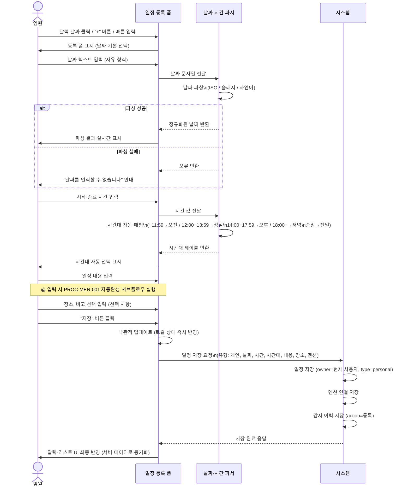
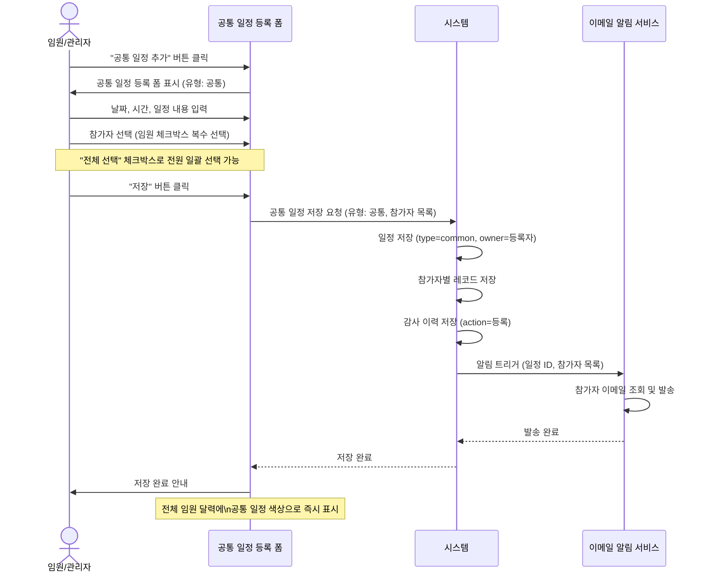
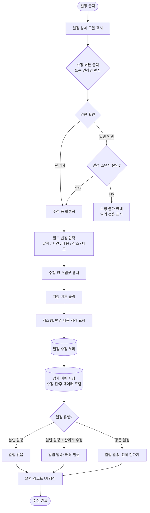
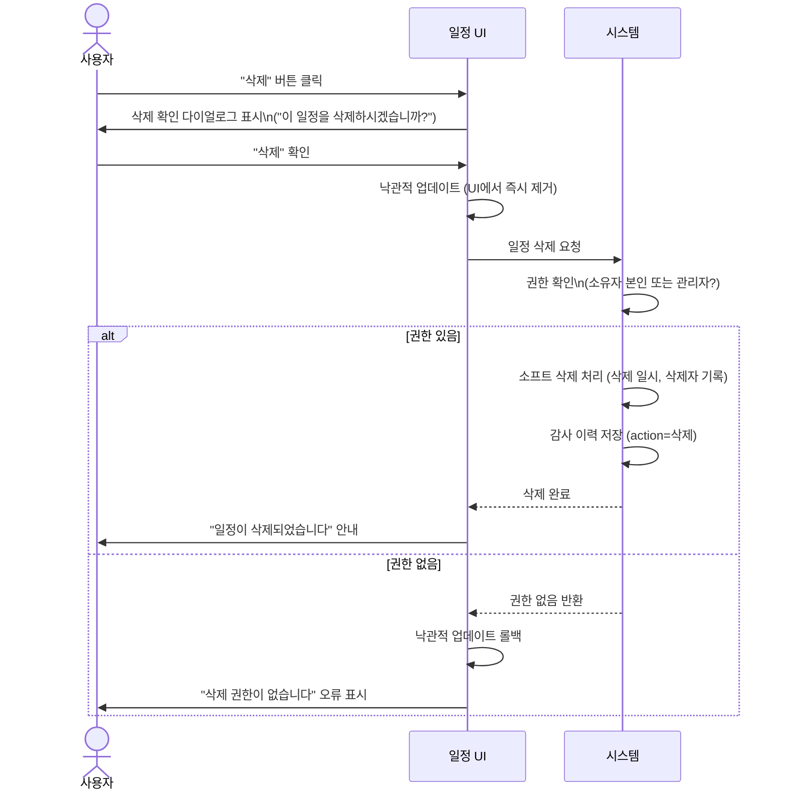
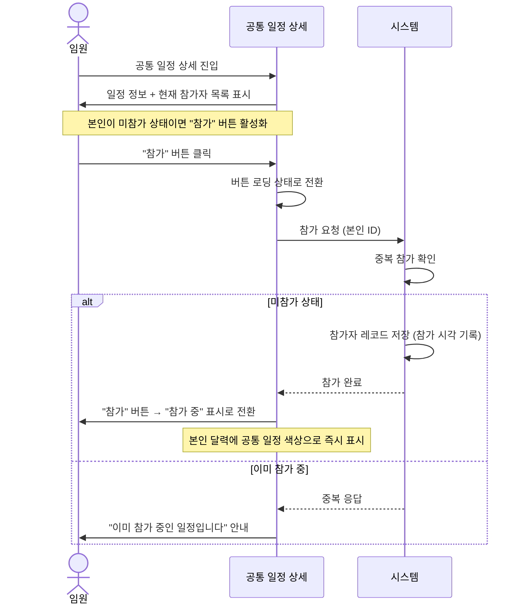

# 일정 관리 프로세스

**관련 화면 명세**: [spec/03_schedule.md](../spec/03_schedule.md), [spec/05_calendar_view.md](../spec/05_calendar_view.md), [spec/06_list_view.md](../spec/06_list_view.md), [spec/07_common_schedule.md](../spec/07_common_schedule.md)

---

## PROC-SCH-001: 개인 일정 등록 프로세스

### 프로세스 ID
`PROC-SCH-001`

### 프로세스명
개인 일정 등록

### 개요
임원이 본인의 개인 일정을 달력 또는 리스트뷰에서 등록하는 프로세스. 날짜 자유 형식 파싱(ISO, 슬래시, 자연어), 시간대 자동 매핑, @멘션 연락처 연동을 포함한다. 저장 시 UI에 즉시 반영된다.

### 참여자 (Actor)
| 역할 | 설명 |
|------|------|
| 임원 (사용자) | 일정을 직접 입력하는 주체 |
| 시스템 | 날짜 파싱, 시간대 매핑, 데이터 저장, UI 갱신을 담당 |

### 사전 조건
- 사용자가 로그인된 상태 (세션 유효)
- 달력 또는 리스트뷰 화면에 접근 가능한 상태

### 트리거
| 트리거 | 설명 |
|--------|------|
| 달력 빈 날짜 클릭 | 해당 날짜가 미리 선택된 상태로 일정 등록 폼 진입 |
| 리스트뷰 "+" 버튼 클릭 | 오늘 날짜 기본 선택으로 폼 진입 |
| 빠른 입력 | 헤더/플로팅 버튼에서 자유 텍스트로 즉시 입력 |

### 메인 플로우

### 대안 플로우

| ID | 조건 | 처리 |
|----|------|------|
| ALT-01 | 자연어 날짜 입력 ("내일", "다음주 월요일") | 상대 날짜 계산 후 정규화, 결과를 폼 필드에 미리 채움 |
| ALT-02 | 종일 일정 체크 | 시간 입력 필드 숨김, 시간대='전일'로 고정 저장 |
| ALT-03 | 빠른 입력 모드 | 필수 필드(날짜·내용)만 입력 후 저장, 나머지는 기본값 적용 |

### 예외 플로우

| ID | 조건 | 처리 |
|----|------|------|
| EXC-01 | 날짜 파싱 실패 | 인라인 오류 메시지 표시, 저장 버튼 비활성화 |
| EXC-02 | 종료 시간 < 시작 시간 | "종료 시간이 시작 시간보다 앞섭니다" 경고, 저장 차단 |
| EXC-03 | 저장 실패 (네트워크 오류 등) | 낙관적 업데이트 롤백, 오류 안내 표시 |
| EXC-04 | 세션 만료 | 로그인 페이지로 이동, 입력 내용 임시 보존 |

### 사후 조건
- 달력 및 리스트뷰에 신규 일정이 표시됨
- `schedules` 테이블에 레코드 생성 (type='personal', owner_id=현재 임원)
- `audit_logs`에 생성 이력 기록

### 연관 테이블

| 구분 | 항목 |
|------|------|
| 테이블 | `schedules` |
| 테이블 | `mentions` |
| 테이블 | `audit_logs` |

---

## PROC-SCH-002: 공통 일정 등록 프로세스

### 프로세스 ID
`PROC-SCH-002`

### 프로세스명
공통 일정 등록

### 개요
임원 또는 관리자가 전체(또는 다수) 임원에게 공유되는 공통 일정을 등록하는 프로세스. 참가자를 복수 선택하고 저장 시 선택된 임원 전원에게 이메일 알림이 발송된다.

### 참여자 (Actor)
| 역할 | 설명 |
|------|------|
| 임원 / 관리자 | 공통 일정을 등록하는 주체 |
| 전체 임원 | 공통 일정의 수신 대상 |
| 시스템 | 데이터 저장, 참가자 등록, 이메일 알림 발송 |

### 사전 조건
- 사용자가 로그인된 상태
- 임원 목록이 시스템에 등록되어 있음

### 트리거
- 달력 또는 리스트뷰의 "공통 일정 추가" 버튼 클릭

### 메인 플로우

### 대안 플로우

| ID | 조건 | 처리 |
|----|------|------|
| ALT-01 | 참가자 전체 선택 | "전체 선택" 체크박스로 모든 임원을 일괄 참가자에 추가 |
| ALT-02 | 이메일 발송 실패 | 일정 저장은 유지, 이메일 실패만 별도 로그 기록 후 재시도 등록 |

### 예외 플로우

| ID | 조건 | 처리 |
|----|------|------|
| EXC-01 | 참가자 미선택 상태로 저장 | "참가자를 1명 이상 선택해 주세요" 안내, 저장 차단 |
| EXC-02 | 저장 실패 | 롤백 처리, 오류 안내 표시 |
| EXC-03 | 알림 발송 서비스 타임아웃 | 비동기 재시도 대기열에 등록, 사용자에게는 저장 완료로 표시 |

### 사후 조건
- `schedules` 테이블에 type='common' 레코드 생성
- `schedule_participants` 테이블에 참가자별 레코드 생성
- 선택된 전체 임원 달력에 공통 일정 색상으로 표시
- 선택된 임원 전원에게 이메일 알림 발송

### 연관 테이블

| 구분 | 항목 |
|------|------|
| 테이블 | `schedules` |
| 테이블 | `schedule_participants` |
| 테이블 | `audit_logs` |

---

## PROC-SCH-003: 일정 수정 프로세스

### 프로세스 ID
`PROC-SCH-003`

### 프로세스명
일정 수정

### 개요
임원이 본인 일정을, 관리자는 전체 일정을 수정하는 프로세스. 권한에 따라 수정 가능 범위가 분기되며, 공통 일정 수정 또는 타인 일정 수정 시 해당 임원에게 알림이 발송된다. 변경 전·후 내용은 audit_logs에 저장된다.

### 참여자 (Actor)
| 역할 | 설명 |
|------|------|
| 임원 (본인) | 본인 소유 일정만 수정 가능 |
| 관리자 | 전체 임원 일정 수정 가능 |
| 시스템 | 권한 검사, 변경 저장, 알림 트리거 |

### 사전 조건
- 사용자가 로그인된 상태
- 수정 대상 일정이 삭제되지 않은 상태

### 트리거
- 달력 또는 리스트뷰에서 일정 클릭 → 수정 버튼 클릭
- 일정 카드 인라인 편집 (더블클릭 또는 편집 아이콘)

### 메인 플로우

### 대안 플로우

| ID | 조건 | 처리 |
|----|------|------|
| ALT-01 | 인라인 편집 (더블클릭) | 모달 없이 카드 내 필드 직접 편집, 포커스 이탈 시 자동 저장 |
| ALT-02 | 공통 일정의 시간만 변경 | 참가자 목록 변경 없이 일정 정보만 갱신, 전체 알림 발송 |

### 예외 플로우

| ID | 조건 | 처리 |
|----|------|------|
| EXC-01 | 수정 중 다른 사용자가 동일 레코드 수정 | 저장 시 충돌 감지 → "다른 사용자가 수정했습니다" 경고 + 최신 내용 리로드 |
| EXC-02 | 권한 없는 수정 시도 | 권한 없음 안내, 오류 토스트 표시 |
| EXC-03 | 저장 요청 실패 | 낙관적 업데이트 롤백, 오류 안내 표시 |

### 사후 조건
- `schedules` 테이블 해당 레코드 변경 필드 업데이트
- `audit_logs` 테이블에 수정 이력 기록 (수정 전/후 데이터)
- 공통 일정 또는 타인 일정 수정 시 이메일 알림 발송

### 연관 테이블

| 구분 | 항목 |
|------|------|
| 테이블 | `schedules` |
| 테이블 | `audit_logs` |

---

## PROC-SCH-004: 일정 삭제 프로세스

### 프로세스 ID
`PROC-SCH-004`

### 프로세스명
일정 삭제 (소프트 딜리트)

### 개요
임원(본인 일정) 또는 관리자(전체)가 일정을 삭제하는 프로세스. 물리 삭제 없이 삭제 일시와 삭제자를 기록하는 소프트 딜리트 방식을 사용하며, 이력은 audit_logs에 남긴다.

### 참여자 (Actor)
| 역할 | 설명 |
|------|------|
| 임원 (본인) | 본인 소유 일정 삭제 가능 |
| 관리자 | 전체 일정 삭제 가능 |
| 시스템 | 권한 검사, 소프트 삭제 처리, 이력 기록 |

### 사전 조건
- 사용자가 로그인된 상태
- 대상 일정이 삭제되지 않은 상태

### 트리거
- 일정 상세 모달 또는 리스트 카드의 "삭제" 버튼 클릭
- 키보드 Delete 키 (리스트뷰 선택 상태)

### 메인 플로우

### 대안 플로우

| ID | 조건 | 처리 |
|----|------|------|
| ALT-01 | 공통 일정 삭제 | 전체 참가자에게 "공통 일정이 삭제되었습니다" 이메일 알림 발송 후 소프트 삭제 |
| ALT-02 | 삭제 후 실행 취소 요청 | 토스트에 "실행 취소" 버튼 제공, 클릭 시 삭제 정보 초기화로 복원 (30초 내) |

### 예외 플로우

| ID | 조건 | 처리 |
|----|------|------|
| EXC-01 | 삭제 요청 실패 | 낙관적 업데이트 롤백, "삭제 중 오류가 발생했습니다" 안내 |
| EXC-02 | 이미 삭제된 일정 접근 | 해당 일정 없음 안내, UI에서 목록에서 제거 |

### 사후 조건
- `schedules`: 삭제 일시, 삭제자 기록 (물리 삭제 아님)
- 달력 및 리스트뷰에서 해당 일정 더 이상 표시되지 않음
- `audit_logs` 테이블에 삭제 이력 기록

### 연관 테이블

| 구분 | 항목 |
|------|------|
| 테이블 | `schedules` (deleted_at, deleted_by 컬럼) |
| 테이블 | `audit_logs` |

---

## PROC-SCH-005: 공통 일정 참가자 자기 추가 프로세스

### 프로세스 ID
`PROC-SCH-005`

### 프로세스명
공통 일정 참가자 자기 추가

### 개요
공통 일정 상세에서 임원이 스스로 참가자로 등록하는 프로세스. 별도 수락/거절 절차 없이 즉시 `schedule_participants` 테이블에 본인 ID가 등록된다.

### 참여자 (Actor)
| 역할 | 설명 |
|------|------|
| 임원 | 공통 일정에 본인을 참가자로 추가하는 주체 |
| 시스템 | 중복 검사, 참가자 레코드 생성 |

### 사전 조건
- 사용자가 로그인된 상태
- 해당 공통 일정이 존재하며 삭제되지 않은 상태
- 현재 사용자가 해당 공통 일정의 참가자 목록에 없는 상태

### 트리거
- 공통 일정 상세 화면의 "참가" 버튼 클릭

### 메인 플로우

### 대안 플로우

| ID | 조건 | 처리 |
|----|------|------|
| ALT-01 | 참가 취소 | "참가 중" 버튼 클릭 → 확인 다이얼로그 → 참가자 레코드 소프트 삭제 |

### 예외 플로우

| ID | 조건 | 처리 |
|----|------|------|
| EXC-01 | 요청 실패 | 오류 안내, 버튼 상태 원복 |
| EXC-02 | 일정이 이미 삭제된 경우 | "삭제된 일정입니다" 안내 후 목록으로 복귀 |

### 사후 조건
- `schedule_participants` 테이블에 현재 임원의 참가 레코드 생성
- 본인 달력에 해당 공통 일정이 표시됨
- 수락/거절 상태 필드 없음 (즉시 확정)

### 연관 테이블

| 구분 | 항목 |
|------|------|
| 테이블 | `schedule_participants` |
