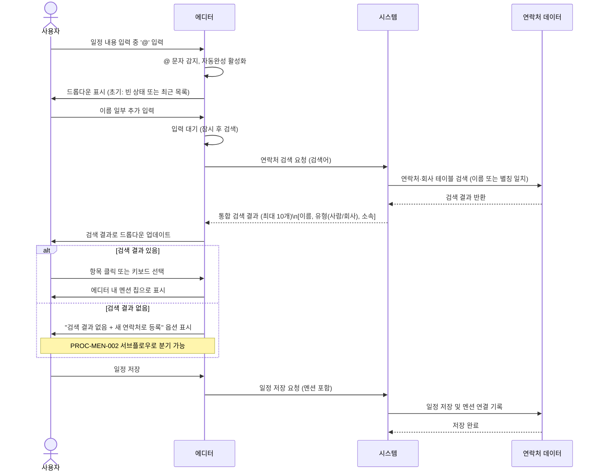
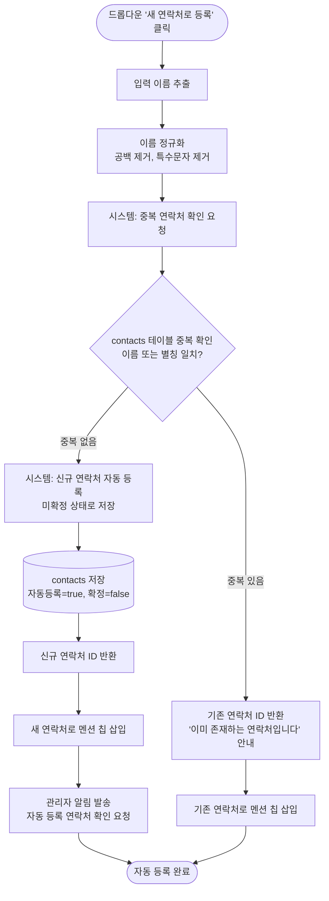
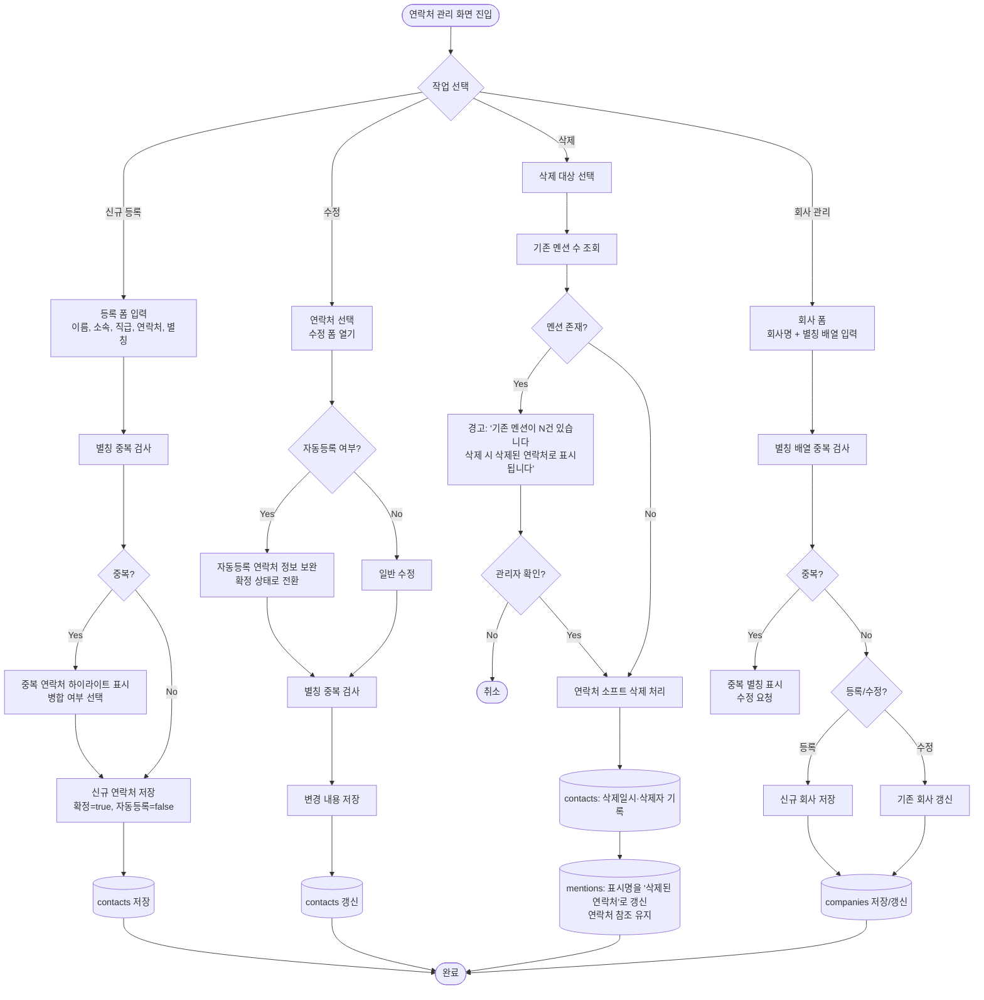

# 멘션 및 연락처 프로세스

**관련 화면 명세**: [spec/04_mention_contact.md](../spec/04_mention_contact.md)

---

## PROC-MEN-001: @멘션 자동완성 프로세스

### 프로세스 ID
`PROC-MEN-001`

### 프로세스명
@멘션 자동완성

### 개요
일정 내용 입력 중 '@' 문자를 입력하면 에디터가 이를 감지하여 연락처 및 회사 통합 검색 드롭다운을 표시한다. 사용자가 후보를 선택하면 멘션 노드가 삽입되고, 저장 시 `mentions` 테이블에 연결 기록이 저장된다.

### 참여자 (Actor)
| 역할 | 설명 |
|------|------|
| 사용자 (임원) | 일정 내용 입력 중 @멘션을 입력하는 주체 |
| 에디터 | @ 입력 감지 및 멘션 노드 삽입을 처리하는 클라이언트 컴포넌트 |
| 시스템 | 검색 결과 제공, 멘션 저장 처리 |

### 사전 조건
- 사용자가 일정 등록 또는 수정 폼에 진입한 상태
- 에디터가 렌더링된 상태
- `contacts`, `companies` 테이블에 데이터가 존재함

### 트리거
- 일정 내용 입력 중 `@` 문자 입력

### 메인 플로우

### 대안 플로우

| ID | 조건 | 처리 |
|----|------|------|
| ALT-01 | Escape 키 입력 | 드롭다운 닫힘, @ 문자 일반 텍스트로 유지 |
| ALT-02 | 키보드 방향키로 목록 탐색 | ↑↓로 포커스 이동, Enter로 선택 |
| ALT-03 | 멘션 노드 삭제 | Backspace로 멘션 칩 전체 삭제, mentions 테이블 연결 제거 (저장 시 반영) |

### 예외 플로우

| ID | 조건 | 처리 |
|----|------|------|
| EXC-01 | 검색 응답 지연 (>1초) | 드롭다운에 스켈레톤 로더 표시, 이전 결과 유지 |
| EXC-02 | 검색 오류 | "검색 실패, 다시 시도해 주세요" 표시, 재시도 버튼 제공 |
| EXC-03 | 네트워크 오프라인 | 최근 검색 캐시(메모리)에서 결과 제공, 오프라인 배지 표시 |

### 사후 조건
- 에디터 내 선택된 연락처/회사가 멘션 칩으로 표시됨
- 일정 저장 시 `mentions` 테이블에 일정 ↔ 연락처(또는 회사) 연결 레코드 생성

### 연관 테이블

| 구분 | 항목 |
|------|------|
| 테이블 | `contacts` |
| 테이블 | `companies` |
| 테이블 | `mentions` |

---

## PROC-MEN-002: 새 연락처 자동 등록 프로세스

### 프로세스 ID
`PROC-MEN-002`

### 프로세스명
새 연락처 자동 등록 (@멘션 경유)

### 개요
@멘션 자동완성 검색에서 일치하는 연락처가 없을 때, 사용자가 "새 연락처로 등록" 옵션을 선택하면 입력된 이름으로 연락처를 즉시 생성하는 프로세스. 자동 등록 연락처는 미확정 상태로 저장되며, 관리자에게 확인 요청 알림이 발송된다.

### 참여자 (Actor)
| 역할 | 설명 |
|------|------|
| 사용자 (임원) | @멘션 검색 후 신규 연락처 등록을 요청하는 주체 |
| 시스템 | 이름 정규화, 중복 검사, 연락처 저장, 알림 발송 처리 |
| 관리자 | 자동 등록 연락처 확인 및 정보 보완 담당 |

### 사전 조건
- PROC-MEN-001 @멘션 자동완성 검색 결과가 0건인 상태
- 사용자가 드롭다운에서 "새 연락처로 등록" 옵션을 선택한 상태

### 트리거
- @멘션 자동완성 드롭다운의 "새 연락처로 등록" 항목 클릭

### 메인 플로우

### 대안 플로우

| ID | 조건 | 처리 |
|----|------|------|
| ALT-01 | 이름 정규화 결과를 수정하고 싶을 때 | 등록 전 인라인 수정 입력란 제공 (팝오버 폼) |
| ALT-02 | 회사명으로 자동 등록 요청 | 드롭다운에 "새 회사로 등록" 옵션 별도 제공, companies 테이블에 저장 |

### 예외 플로우

| ID | 조건 | 처리 |
|----|------|------|
| EXC-01 | 이름이 1자 미만 또는 특수문자만 있는 경우 | "유효한 이름을 입력해 주세요" 안내, 등록 차단 |
| EXC-02 | 연락처 저장 실패 | 오류 안내, 드롭다운 유지, 재시도 안내 |
| EXC-03 | 알림 발송 실패 | 연락처 저장은 유지, 알림만 재시도 대기열 등록 |

### 사후 조건
- `contacts` 테이블에 신규 레코드 생성 (자동등록=true, 확정=false)
- 에디터 내 해당 이름이 멘션 칩으로 즉시 표시됨
- 관리자에게 "자동 등록된 연락처 확인 요청" 알림 발송

### 연관 테이블

| 구분 | 항목 |
|------|------|
| 테이블 | `contacts` (is_auto, confirmed, aliases 컬럼) |
| 테이블 | `notification_logs` (또는 이메일) |

---

## PROC-CON-001: 연락처 CRUD 프로세스 (관리자)

### 프로세스 ID
`PROC-CON-001`

### 프로세스명
연락처 CRUD 관리 (관리자)

### 개요
관리자가 연락처(`contacts`) 및 회사(`companies`) 데이터를 직접 등록, 수정, 삭제하는 프로세스. 자동 등록 연락처의 정보를 보완하고 확정하는 역할도 포함한다. 기존 멘션이 있는 연락처 삭제 시 "[삭제된 연락처]"로 표시 처리하는 소프트 삭제를 적용한다.

### 참여자 (Actor)
| 역할 | 설명 |
|------|------|
| 관리자 | 연락처 및 회사 데이터를 관리하는 유일한 주체 |
| 시스템 | 중복 검사, CRUD 처리, 멘션 영향도 처리 |

### 사전 조건
- 관리자 권한으로 로그인된 상태
- 연락처 관리 메뉴 접근 가능

### 트리거
- 연락처 관리 화면에서 "등록", "수정", "삭제" 버튼 클릭
- 자동 등록 연락처 확인 알림에서 "검토" 링크 클릭

### 메인 플로우

### 세부 처리 규칙

#### 연락처 등록
- **동명이인 구분**: ERD `contacts` 에는 별칭(`aliases`) 컬럼이 없다 (별칭 배열은 `companies.aliases` 만 존재). 동명이인은 `contacts.name + contacts.company_id + contacts.title` 조합으로 구분
- `contacts.is_auto_registered = false`, `contacts.status = 'confirmed'` 로 저장 (관리자 직접 등록이므로 즉시 확정)

#### 연락처 수정
- 자동 등록(`is_auto_registered=true`) 연락처 수정 시: 정보 보완 완료 여부를 `status='confirmed'` 로 자동 전환
- 변경 이력은 `audit_logs`에 수정 전/후로 기록

#### 연락처 삭제 (소프트 삭제)
- 물리 삭제 없이 삭제일시, 삭제자 기록
- 기존 멘션(`mentions` 테이블)이 연결된 경우: 멘션 표시명 = '[삭제된 연락처]'로 갱신, 연락처 참조는 유지
- 달력/일정 상세에서 해당 멘션 표시 시 "[삭제된 연락처]" 레이블로 렌더링

#### 회사 관리
- `companies` 테이블: 공식 회사명 + 별칭 배열(약칭/영문명 등)
- 별칭 중복 검사: 다른 회사의 별칭 배열에 동일 값 존재 시 경고
- 회사 삭제 시 연관 연락처의 회사 참조를 미지정 처리

### 대안 플로우

| ID | 조건 | 처리 |
|----|------|------|
| ALT-01 | 자동 등록 연락처 일괄 검토 | 관리자 알림 허브에서 미확정 연락처 목록 표시, 일괄 확인/삭제 기능 제공 |
| ALT-02 | 연락처 병합 | 중복 감지 시 "병합" 선택 → 대표 연락처 지정 → 나머지 연락처 소프트 삭제 + 멘션 재연결 |
| ALT-03 | CSV 일괄 등록 | 관리자가 CSV 파일 업로드 → 이름·소속 파싱 → 중복 검사 후 일괄 저장 |

### 예외 플로우

| ID | 조건 | 처리 |
|----|------|------|
| EXC-01 | 이름 또는 회사명이 빈 값 | "필수 항목입니다" 인라인 오류, 저장 차단 |
| EXC-02 | 별칭 배열에 빈 문자열 포함 | 저장 전 필터링하여 빈 값 자동 제거, 사용자에게 안내 |
| EXC-03 | 요청 실패 | 오류 안내, 입력 내용 보존 |
| EXC-04 | 삭제 대상이 현재 일정에 멘션된 경우 | 경고 다이얼로그에 영향받는 일정 목록 표시 |

### 사후 조건

**등록 시**
- `contacts` 또는 `companies` 테이블에 신규 레코드 생성
- @멘션 검색에 즉시 반영됨

**수정 시**
- `contacts` 또는 `companies` 테이블 해당 레코드 업데이트
- 자동등록 → 확정 전환 (해당 시)

**삭제 시**
- `contacts`: 삭제일시, 삭제자 기록 (소프트 삭제)
- 관련 멘션 표시명 = '[삭제된 연락처]' 처리
- @멘션 검색 결과에서 제외됨

### 연관 테이블

| 구분 | 항목 |
|------|------|
| 테이블 | `contacts` (name, aliases, is_auto, confirmed, deleted_at, deleted_by) |
| 테이블 | `companies` (name, aliases, deleted_at) |
| 테이블 | `mentions` (display_name 컬럼, contact_id 외래키) |
| 테이블 | `audit_logs` |
