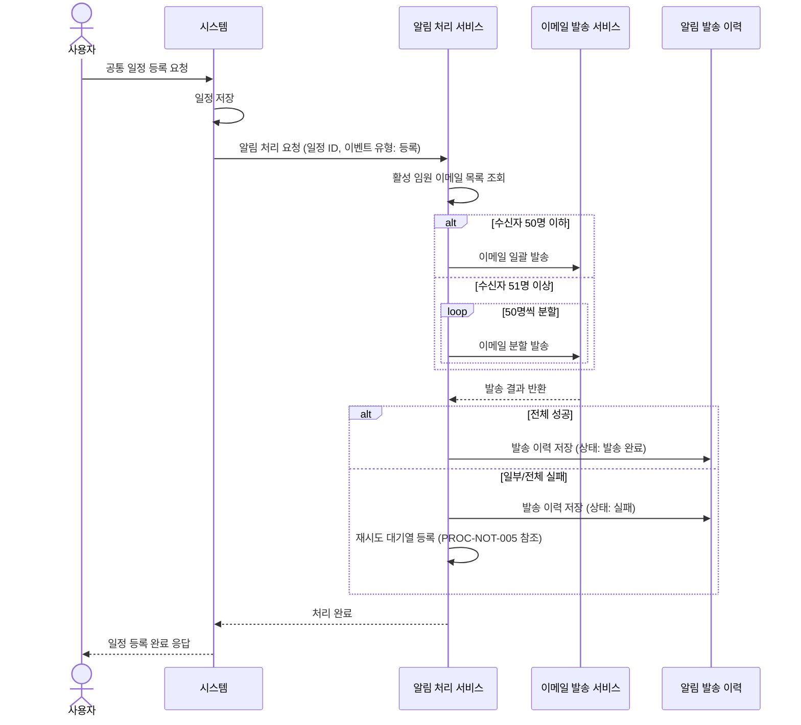
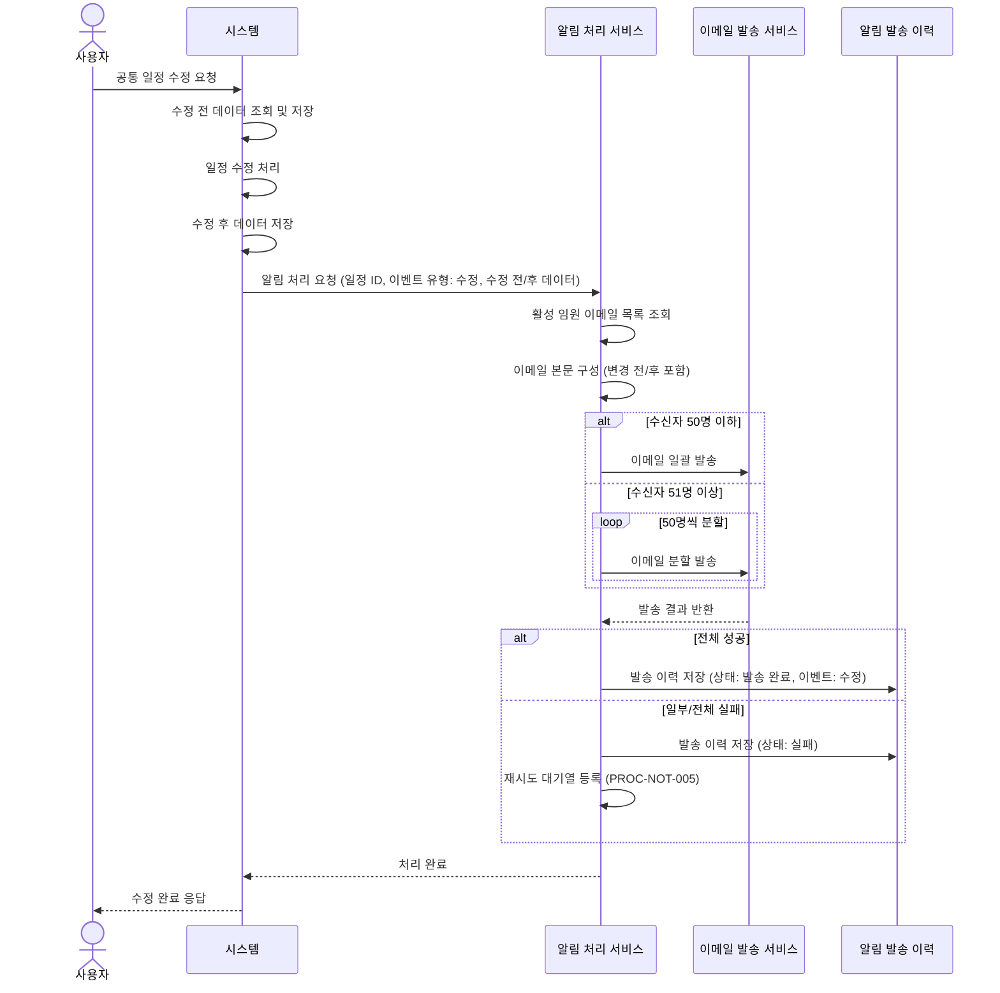
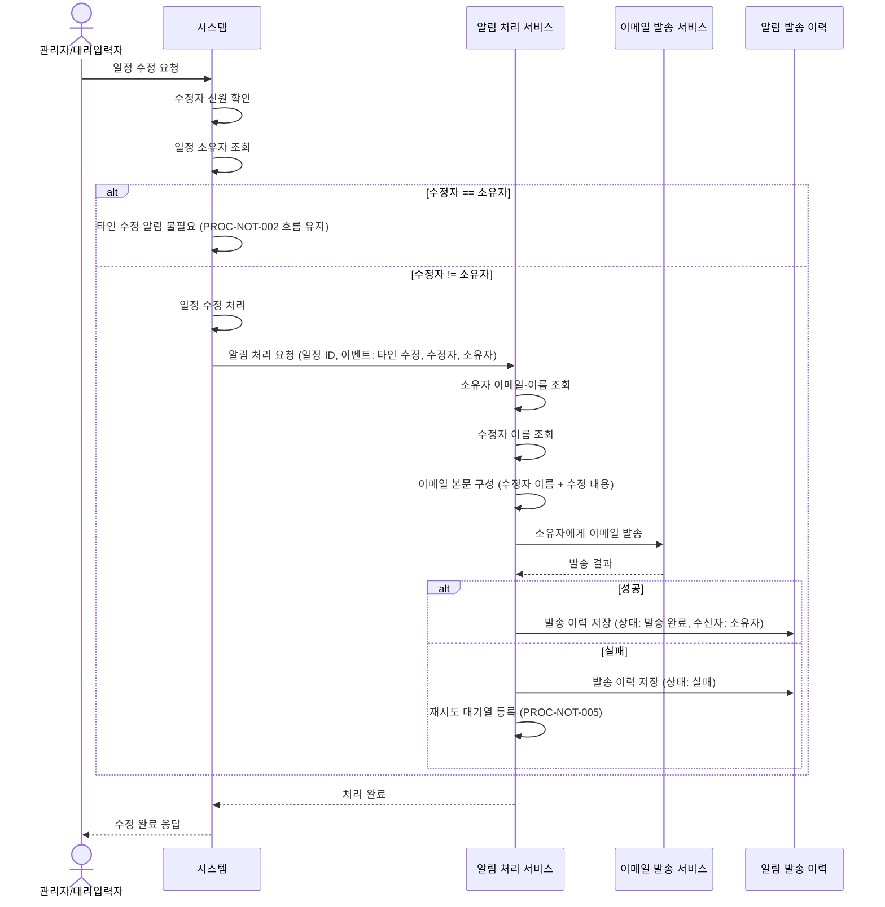
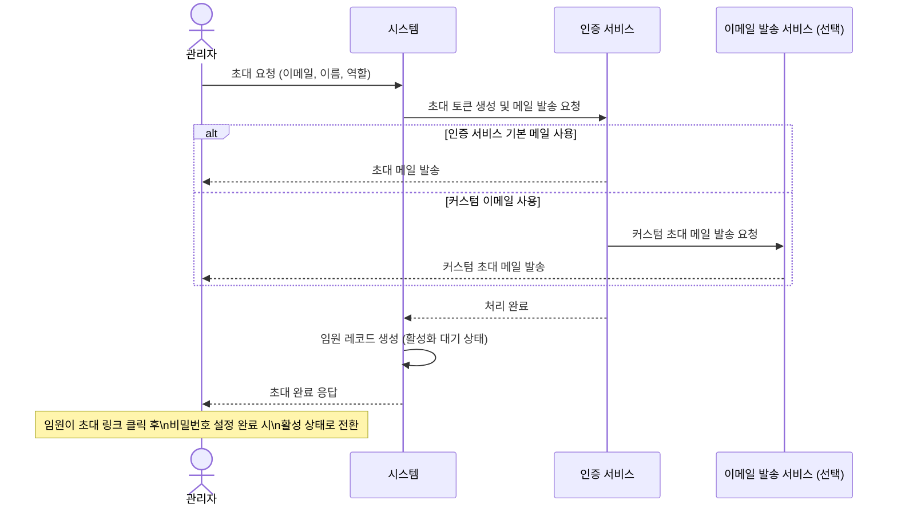
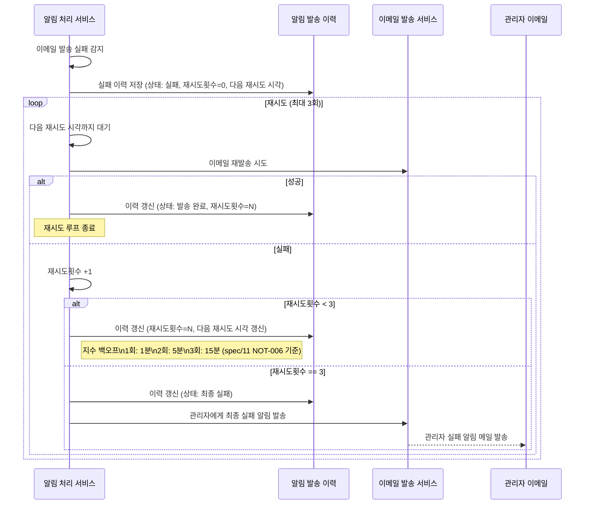

# 알림 발송 프로세스

**관련 화면 명세**: [spec/11_notification.md](../spec/11_notification.md)

## 알림 시스템 아키텍처 개요

임원 일정 관리 시스템의 알림은 크게 두 가지 경로로 처리된다.

| 알림 유형 | 처리 경로 |
|---|---|
| 계정 초대 / 비밀번호 재설정 | 인증 서비스 내장 메일 (또는 커스텀 이메일 발송) |
| 일정 등록·수정 알림 | 시스템 → 알림 처리 서비스 → 이메일 발송 서비스 |

---

## PROC-NOT-001: 공통 일정 등록 알림 프로세스

### 프로세스 ID
`PROC-NOT-001`

### 프로세스명
공통 일정 등록 알림 발송

### 개요
공통 일정이 새로 등록된 이후, 전체 활성 임원에게 이메일 알림을 일괄 발송한다. 발송 결과는 `notification_logs` 테이블에 기록하며, 실패 시 최대 3회 재시도를 수행한다.

### 참여자 (Actor)

| Actor | 역할 |
|---|---|
| 사용자 (관리자 / 임원) | 공통 일정 등록 |
| 시스템 | 일정 저장 및 알림 처리 서비스 호출 |
| 알림 처리 서비스 | 수신자 조회 및 이메일 발송 서비스 호출 |
| 이메일 발송 서비스 | 이메일 실제 발송 |

### 사전 조건

- 사용자가 인증된 상태로 로그인되어 있다.
- 활성 임원이 1명 이상 존재한다.
- 알림 처리 서비스가 배포·활성화되어 있다.
- 이메일 발송 서비스 설정이 완료되어 있다.

### 트리거

공통 일정이 저장된 직후, 시스템에서 알림 처리 서비스를 호출한다.

### 메인 플로우



### 대안 플로우

| 조건 | 처리 |
|---|---|
| 활성 임원이 0명인 경우 | 알림 처리 서비스가 조기 종료. 발송 이력에 '수신자 없음' 기록 |
| 이메일 발송 서비스 설정 오류 | 알림 처리 서비스 초기화 실패. 발송 이력에 '설정 오류' 기록 |

### 예외 플로우

| 예외 상황 | 처리 방식 |
|---|---|
| 알림 서비스 호출 타임아웃 | 시스템은 응답 반환 후 백그라운드에서 재시도 |
| 이메일 서비스 일시 장애 | PROC-NOT-005 재시도 로직 위임 |
| DB 연결 오류 | 오류 캐치 후 발송 이력에 'DB 오류' 상태 기록 |

### 사후 조건

- `notification_logs`에 발송 시도 기록이 존재한다.
- 성공 시: 전체 활성 임원이 이메일을 수신한다.
- 실패 시: PROC-NOT-005에 따라 재시도가 예약된다.

### 연관 테이블

| 구분 | 대상 |
|---|---|
| 테이블 | `schedules`, `users`, `notification_logs` |

---

## PROC-NOT-002: 공통 일정 수정 알림 프로세스

### 프로세스 ID
`PROC-NOT-002`

### 프로세스명
공통 일정 수정 알림 발송

### 개요
공통 일정이 수정된 경우 전체 활성 임원에게 변경 전/후 내용을 포함한 알림 이메일을 발송한다. 발송 흐름은 PROC-NOT-001과 동일하며, 이메일 본문에 변경 전(before)과 변경 후(after) 내용이 추가된다.

### 참여자 (Actor)

| Actor | 역할 |
|---|---|
| 사용자 (관리자 / 임원) | 공통 일정 수정 |
| 시스템 | 일정 갱신 및 알림 처리 서비스 호출 |
| 알림 처리 서비스 | 변경 전/후 데이터 포함 이메일 구성 및 발송 |
| 이메일 발송 서비스 | 이메일 실제 발송 |

### 사전 조건

- PROC-NOT-001의 사전 조건과 동일.
- 수정 전 기존 데이터 스냅샷이 함께 전달된다.

### 트리거

공통 일정이 수정된 직후.

### 메인 플로우



### 이메일 본문 변경 전/후 구성 예시

```
[일정 변경 알림]

■ 변경 전
  - 제목: 전체 임원 회의
  - 일시: 2026-05-15 14:00
  - 장소: 3층 대회의실

■ 변경 후
  - 제목: 전체 임원 회의 (긴급 변경)
  - 일시: 2026-05-15 16:00
  - 장소: 화상 회의
```

### 대안 플로우

PROC-NOT-001의 대안 플로우와 동일.

### 예외 플로우

| 예외 상황 | 처리 방식 |
|---|---|
| 수정 전 스냅샷 조회 실패 | 수정 후 데이터만으로 이메일 발송. 본문에 "변경 전 정보 없음" 표기 |
| PROC-NOT-001 예외 플로우 | 동일 적용 |

### 사후 조건

- `notification_logs`에 수정 이벤트 기록이 존재한다.
- 전체 활성 임원이 변경 전/후 내용을 담은 이메일을 수신한다.

### 연관 테이블

| 구분 | 대상 |
|---|---|
| 테이블 | `schedules`, `users`, `notification_logs` |

---

## PROC-NOT-003: 타인 일정 수정 알림 프로세스

### 프로세스 ID
`PROC-NOT-003`

### 프로세스명
타인 일정 수정 시 일정 소유자 알림

### 개요
관리자 또는 대리 입력자가 다른 임원의 개인 일정을 수정할 경우, 해당 일정의 소유 임원(owner)에게만 수정 사실을 알리는 이메일을 발송한다.

### 참여자 (Actor)

| Actor | 역할 |
|---|---|
| 관리자 / 대리 입력자 | 타인 일정 수정 요청 |
| 시스템 | 수정자 ≠ 소유자 조건 감지 및 알림 처리 서비스 호출 |
| 알림 처리 서비스 | 소유자 이메일 조회 및 발송 |
| 이메일 발송 서비스 | 이메일 실제 발송 |

### 사전 조건

- 수정 요청자의 신원이 인증 정보에서 식별 가능하다.
- 대상 일정의 소유자가 기록되어 있다.

### 트리거

일정 수정 처리 중 수정자 ≠ 소유자 조건이 감지된 시점.

### 메인 플로우



### 이메일 본문 구성 예시

```
[일정 수정 알림]

홍길동 님의 일정이 김철수(관리자)에 의해 수정되었습니다.

■ 수정된 내용
  - 일시: 2026-05-20 10:00 → 2026-05-20 14:00
  - 장소: 변경 없음
```

### 대안 플로우

| 조건 | 처리 |
|---|---|
| 수정자가 소유자와 동일한 경우 | 타인 알림 없이 PROC-NOT-002 흐름으로 처리 |
| 소유자가 비활성 상태인 경우 | 알림 발송 생략, 발송 이력에 '생략' 기록 |

### 예외 플로우

| 예외 상황 | 처리 방식 |
|---|---|
| 소유자 이메일 조회 실패 | 발송 이력에 '조회 오류' 기록, 관리자에게 별도 알림 |

### 사후 조건

- 소유 임원이 "누가 내 일정을 수정했는지" 이메일을 수신한다.
- `notification_logs`에 수신자 = 소유자로 기록이 존재한다.

### 연관 테이블

| 구분 | 대상 |
|---|---|
| 테이블 | `schedules`, `users`, `notification_logs` |

---

## PROC-NOT-004: 초대 메일 발송 프로세스

### 프로세스 ID
`PROC-NOT-004`

### 프로세스명
신규 임원 계정 초대 메일 발송

### 개요
관리자가 신규 임원을 시스템에 등록할 때 인증 서비스를 통해 초대 이메일을 발송한다. 필요 시 커스텀 템플릿 메일로 대체 발송할 수 있다.

### 참여자 (Actor)

| Actor | 역할 |
|---|---|
| 관리자 | 신규 임원 초대 요청 |
| 시스템 | 인증 서비스 호출 |
| 인증 서비스 | 초대 토큰 생성 및 메일 발송 |
| (선택) 이메일 발송 서비스 | 커스텀 템플릿 메일 대체 발송 |

### 사전 조건

- 관리자 권한으로 인증된 상태이다.
- 초대할 이메일 주소가 아직 시스템에 등록되지 않은 상태이다.
- 인증 서비스에서 이메일 인증이 활성화되어 있다.

### 트리거

관리자가 임원 등록 폼에서 "초대 메일 발송" 버튼 클릭.

### 메인 플로우



### 대안 플로우

| 조건 | 처리 |
|---|---|
| 이미 가입된 이메일인 경우 | 인증 서비스에서 오류 반환, 중복 안내 응답 |
| 커스텀 메일 미사용 시 | 인증 서비스 내장 이메일로 기본 초대 메일 발송 |

### 예외 플로우

| 예외 상황 | 처리 방식 |
|---|---|
| 인증 서비스 오류 | 임원 레코드 저장 중단, 오류 안내 |
| 초대 링크 만료 (기본 24시간) | 관리자가 재초대 진행 |

### 사후 조건

- 초대 이메일이 대상자에게 발송된다.
- `users` 테이블에 활성화 대기 상태로 임원 레코드가 생성된다.
- 대상자가 초대 링크를 수락하면 활성 상태로 갱신된다.

### 연관 테이블

| 구분 | 대상 |
|---|---|
| 테이블 | `users` |

---

## PROC-NOT-005: 알림 실패 처리 프로세스

### 프로세스 ID
`PROC-NOT-005`

### 프로세스명
알림 발송 실패 처리 및 재시도

### 개요
이메일 발송이 실패한 경우 `notification_logs` 테이블에 실패 기록을 남기고, 지수 백오프(Exponential Backoff) 방식으로 최대 3회 재시도를 수행한다. 3회 모두 실패하면 관리자에게 발송 실패 알림을 전송한다.

### 참여자 (Actor)

| Actor | 역할 |
|---|---|
| 알림 처리 서비스 | 재시도 로직 실행 |
| 알림 발송 이력 (`notification_logs`) | 실패 기록 및 재시도 횟수 관리 |
| 이메일 발송 서비스 | 재시도 이메일 발송 |
| 관리자 | 최종 실패 알림 수신 |

### 사전 조건

- `notification_logs` 테이블에 실패 상태 레코드가 존재한다.
- 재시도 횟수가 3회 미만인 레코드만 재시도 대상이다.

### 트리거

- 알림 처리 서비스에서 이메일 발송 실패 직후 (즉시 재시도)
- 또는 스케줄러가 주기적으로 실패 레코드를 조회하여 재시도 실행

### 메인 플로우



### 지수 백오프 스케줄 (spec/11 NOT-006 기준 채택)

| 시도 | 대기 시간 | 누적 경과 |
|---|---|---|
| 1차 재시도 | 1분 | 1분 |
| 2차 재시도 | 5분 | 6분 |
| 3차 재시도 | 15분 | 21분 |
| 최종 실패 처리 | — | 약 21분 |

> SSOT 우선순위(§5.4 spec > process)에 따라 spec/11 의 1분/5분/15분 간격을 채택. 이전 30초/60초/120초 표기는 정정함.

### 대안 플로우

| 조건 | 처리 |
|---|---|
| 관리자 이메일 발송도 실패 | 이력 기록만 유지. 별도 모니터링 채널 연동 권장 |

### 예외 플로우

| 예외 상황 | 처리 방식 |
|---|---|
| 이력 저장 실패 | 서비스 로그에만 기록 |

### 사후 조건

- 성공 시: 발송 이력 상태 = '발송 완료'
- 최종 실패 시: 발송 이력 상태 = '최종 실패', 관리자 이메일 발송 완료

### 연관 테이블

| 구분 | 대상 |
|---|---|
| 테이블 | `notification_logs` (event_type, recipient_id, recipient_email, target_type, target_id, channel, status, attempt_count, last_attempted_at, sent_at, error_message, payload, created_at, updated_at) — 대상 일정은 `target_type='schedule'` + `target_id` 로 표기 |
