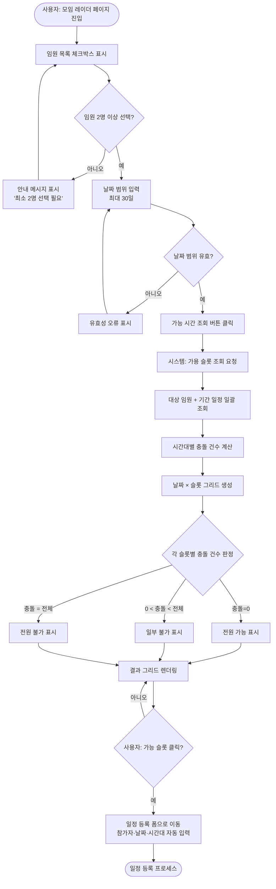
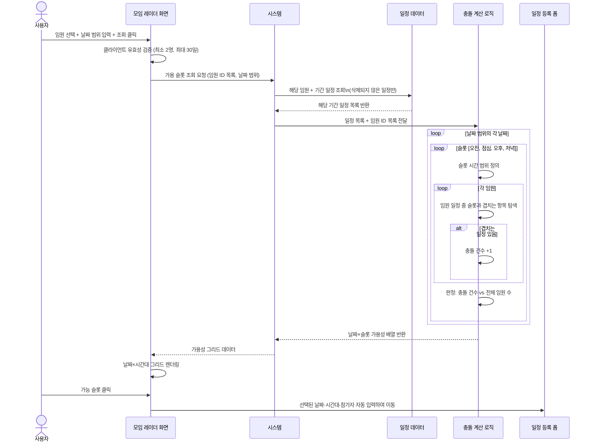

# 모임 레이더 프로세스

**관련 화면 명세**: [spec/09_meeting_radar.md](../spec/09_meeting_radar.md)

---

## PROC-RAD-001: 가용 슬롯 탐색 전체 프로세스

### 프로세스 ID
`PROC-RAD-001`

### 프로세스명
모임 레이더 가용 시간 슬롯 탐색

### 개요
사용자가 모임 레이더 페이지에서 참석 대상 임원과 날짜 범위를 지정하면, 시스템이 해당 임원들의 기존 일정과 시간대를 분석하여 가용 슬롯(오전/점심/오후/저녁)을 날짜×시간대 그리드로 시각화한다. 슬롯 클릭 시 일정 등록 폼으로 자동 연동된다.

### 참여자 (Actor)

| Actor | 역할 |
|---|---|
| 사용자 (관리자 / 임원) | 참석자 선택, 날짜 범위 지정, 결과 확인 및 일정 등록 |
| 시스템 | 일정 조회, 슬롯 충돌 계산, 결과 그리드 제공 |

### 사전 조건

- 사용자가 인증된 상태로 로그인되어 있다.
- 임원이 2명 이상 존재한다.
- 날짜 범위는 최소 1일, 최대 30일 이내이다.

### 트리거

모임 레이더 페이지에서 임원 체크박스 선택(최소 2명) + 날짜 범위 입력 후 "가능 시간 조회" 버튼 클릭.

### 메인 플로우 — 전체 흐름 (flowchart)



### 메인 플로우 — 조회 흐름 (sequenceDiagram)



### 충돌 계산 알고리즘 상세

#### 시간대(슬롯) 정의

| 슬롯명 | 시간 범위 | 기준 |
|---|---|---|
| 오전 | 00:00 ~ 11:59 | — |
| 점심 | 12:00 ~ 13:59 | — |
| 오후 | 14:00 ~ 17:59 | — |
| 저녁 | 18:00 ~ 23:59 | — |

> 전일 일정은 모든 슬롯에 영향을 미친다. 전일 일정이 있는 임원은 해당 날짜의 4개 슬롯 모두에서 '바쁨'으로 처리된다.

#### 가용성 판정 기준

| 조건 | 상태 | 표시 |
|---|---|---|
| 충돌 건수 = 0 | 전원 가능 | ✅ |
| 0 < 충돌 건수 < 전체 임원 수 | 일부 불가 | 🟡 |
| 충돌 건수 = 전체 임원 수 | 전원 불가 | ❌ |

### 결과 그리드 UI 구조 예시

```
           | 오전 ☀️ | 점심 🍱 | 오후 💼 | 저녁 🌙 |
2026-05-12 |   ✅   |   🟡   |   ✅   |   ❌   |
2026-05-13 |   ❌   |   ✅   |   🟡   |   ✅   |
2026-05-14 |   ✅   |   ✅   |   ✅   |   🟡   |
```

- ✅ 슬롯 클릭 시: 일정 등록 폼으로 이동 (해당 날짜, 시간대, 선택된 임원 자동 입력)
- 🟡 슬롯 호버 시: 불가 임원 이름 툴팁 표시

### 대안 플로우

| 조건 | 처리 |
|---|---|
| 조회 기간에 일정이 전혀 없는 경우 | 모든 슬롯이 ✅로 표시됨 |
| 임원을 1명만 선택한 경우 | 클라이언트 유효성 오류 표시, 조회 차단 |
| 날짜 범위가 30일 초과인 경우 | 범위 초과 오류 안내 |

### 예외 플로우

| 예외 상황 | 처리 방식 |
|---|---|
| DB 조회 타임아웃 | 오류 안내, 재시도 안내 표시 |
| 선택된 임원 ID가 DB에 없는 경우 | 해당 임원을 결과에서 제외하고 경고 메시지 표시 |
| 날짜 범위에 과거 날짜 포함 | 처리는 허용하되, 과거 날짜 슬롯은 비활성화(클릭 불가) 처리 |

### 사후 조건

- 날짜×슬롯 그리드가 화면에 렌더링된다.
- 사용자가 가능 슬롯을 선택하면 일정 등록 폼이 자동 완성되어 열린다.

### 연관 테이블

| 구분 | 대상 |
|---|---|
| 테이블 | `schedules`, `users` |
| 연계 프로세스 | 일정 등록 프로세스 (PROC-SCH-001 등) |
