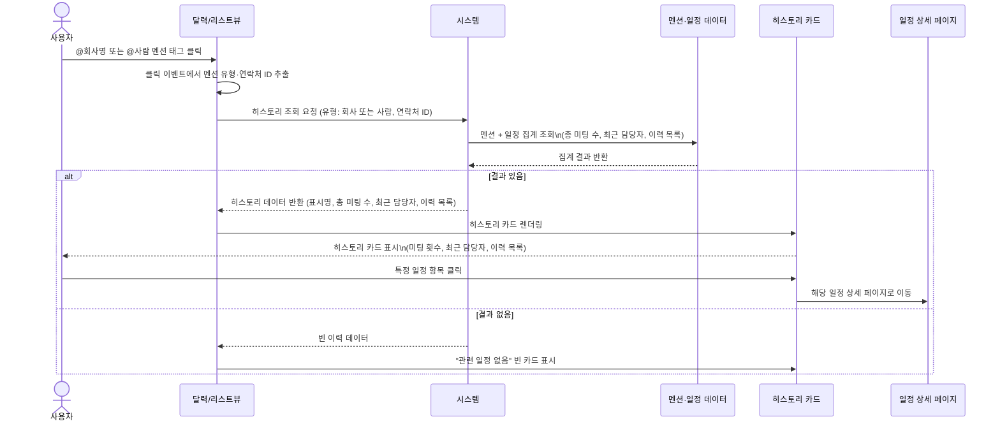

# 관계 히스토리 프로세스

**관련 화면 명세**: [spec/10_relationship_history.md](../spec/10_relationship_history.md)

---

## PROC-REL-001: 관계 히스토리 카드 조회 프로세스

### 프로세스 ID
`PROC-REL-001`

### 프로세스명
멘션 태그 기반 관계 히스토리 카드 조회

### 개요
사용자가 달력 또는 리스트뷰에서 일정 내용에 삽입된 `@회사명` 또는 `@사람` 멘션 태그를 클릭하면, 해당 회사 또는 인물과의 모든 미팅 이력을 집계·정렬하여 히스토리 카드(팝오버 또는 사이드 패널)로 표시한다. 카드에서 특정 일정을 클릭하면 해당 일정 상세로 이동한다.

### 참여자 (Actor)

| Actor | 역할 |
|---|---|
| 사용자 (관리자 / 임원) | 멘션 태그 클릭, 히스토리 카드 확인, 일정 상세 이동 |
| 화면 (달력/리스트뷰) | 태그 클릭 이벤트 감지, 팝오버/사이드 패널 렌더링 |
| 시스템 | 이력 집계 조회 및 히스토리 데이터 반환 |

### 사전 조건

- 사용자가 인증된 상태로 로그인되어 있다.
- 클릭한 멘션 태그에 유형(회사 또는 사람)과 연락처 ID가 연결되어 있다.
- `mentions` 테이블에 해당 연락처로 연결된 레코드가 1건 이상 존재한다.

### 트리거

달력뷰 또는 리스트뷰에서 일정 내용 내의 `@회사명` 또는 `@사람` 멘션 태그를 클릭.

### 메인 플로우



### 집계 데이터 구성

시스템은 멘션 + 일정 + 담당 임원 데이터를 조인하여 다음 정보를 집계한다:
- 해당 연락처(회사 또는 인물)와의 전체 미팅 횟수
- 가장 최근 일정 기준 담당 임원
- 일정별 이력 목록 (날짜, 담당 임원, 장소, 내용 요약)

### 히스토리 카드 UI 구성

```
┌──────────────────────────────────────────────┐
│ @삼성전자                              [닫기] │
├──────────────────────────────────────────────┤
│ 총 미팅 횟수: 5회                            │
│ 최근 담당자: 박영희 전무                     │
├──────────────────────────────────────────────┤
│ ▼ 미팅 이력 (최신순)                         │
│                                              │
│ 2026-05-08 │ 김철수 부사장 │ 여의도 본사     │
│ 분기 실적 리뷰                    →상세보기  │
│                                              │
│ 2026-04-15 │ 이영호 상무   │ 화상 회의       │
│ 사업 협력 논의                    →상세보기  │
│                                              │
│ 2026-03-22 │ 박영희 전무   │ 강남 오피스     │
│ 계약 조건 협의                    →상세보기  │
└──────────────────────────────────────────────┘
```

#### 히스토리 카드 표시 필드

| 필드 | 출처 | 설명 |
|---|---|---|
| 날짜 | `schedules.schedule_date` | YYYY-MM-DD 형식 |
| 담당자(임원명) | 소유 임원 이름 (`users.name`, `schedules.owner_id` 조인) | 해당 일정의 소유 임원 |
| 장소 | `schedules.location` | 없을 경우 "미정" 표시 |
| 일정 내용 요약 | `schedules.title` 앞 100자 | 클릭 시 상세 이동 |
| 총 미팅 횟수 | 집계 결과 | 카드 상단 집계 |
| 최근 담당자 | 집계 결과 | 가장 최근 일정 기준 |

### 대안 플로우

| 조건 | 처리 |
|---|---|
| 관련 일정이 0건인 경우 | 빈 히스토리 카드 표시. "관련 일정 기록이 없습니다" 안내 문구 |
| 동일 날짜에 복수 일정이 있는 경우 | 각각 별도 항목으로 리스트에 표시 (날짜 중복 허용) |
| 멘션 태그에 유형 또는 연락처 ID 누락 | 이벤트 핸들러에서 조회 차단, 경고 표시 |

### 예외 플로우

| 예외 상황 | 처리 방식 |
|---|---|
| 조회 응답 타임아웃 (> 5초) | "데이터를 불러오는 중 오류가 발생했습니다" 표시. 재시도 버튼 제공 |
| 연락처 ID가 DB에 없는 경우 | 빈 이력 데이터 반환. 빈 카드 표시 |
| 삭제된 일정 | 조회 시 자동 제외됨 |
| 인증 만료 상태에서 조회 | 인증 오류 안내, 로그인 페이지로 이동 |

### 사후 조건

- 히스토리 카드가 화면에 표시되어 있다.
- 미팅 이력이 최신순으로 정렬되어 표시된다.
- 총 미팅 횟수와 최근 담당자가 카드 상단에 집계된다.
- 특정 일정 클릭 시 해당 일정 상세 페이지로 이동한다.

### 연관 테이블

| 구분 | 대상 |
|---|---|
| 테이블 | `mentions`, `schedules`, `users` |
| 연계 페이지 | 일정 상세 페이지 |
