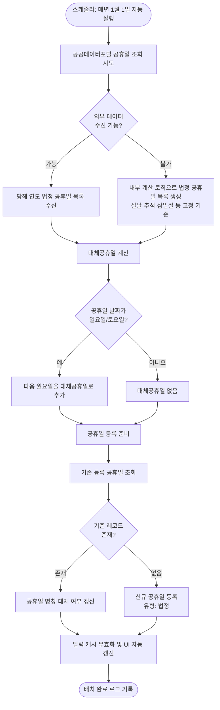
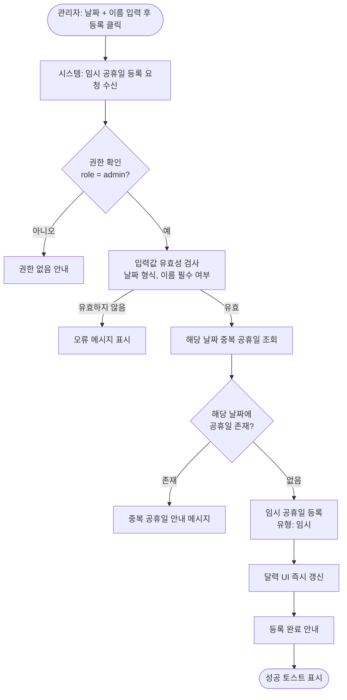
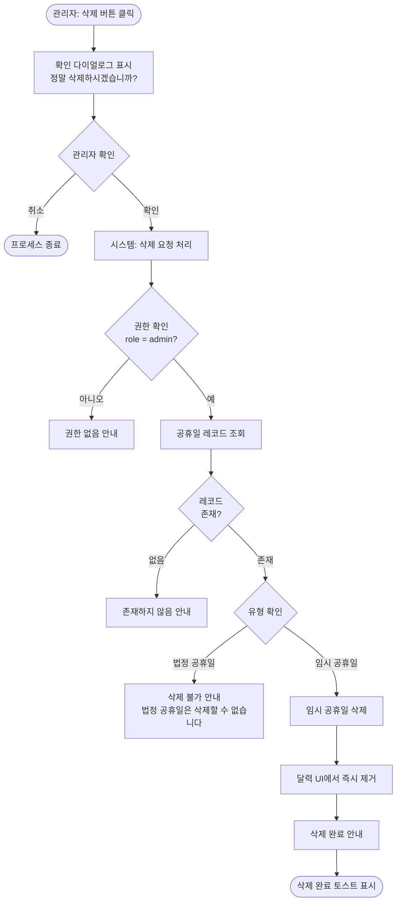

# 공휴일 관리 프로세스 정의서

**관련 화면 명세**: [spec/08_holiday.md](../spec/08_holiday.md)

---

## PROC-HOL-001: 연간 법정 공휴일 자동 등록 프로세스

### 개요

매년 1월 1일 배치 잡이 자동 실행되어 해당 연도의 법정 공휴일 목록을 생성하고 `holidays` 테이블에 등록하는 프로세스이다. 공공데이터포털 또는 내부 계산 로직을 통해 공휴일 날짜를 산출하며, 대체공휴일(일요일·토요일과 겹치는 경우 다음 평일)을 함께 계산하여 등록한다. 등록된 공휴일은 달력 뷰에 자동 반영된다.

### 참여자 (Actor)

| 구분 | 설명 |
|---|---|
| 스케줄러 | 매년 1월 1일 자동 실행하는 배치 스케줄러 |
| 시스템 | 공휴일 계산, 데이터 저장, 달력 갱신 처리 |
| 공공데이터포털 | 정부 법정 공휴일 데이터 제공자 (data.go.kr) |
| 달력 UI | 공휴일 정보를 표시하는 프론트엔드 뷰 |

### 사전 조건

- 스케줄러가 활성화되어 있으며 실행 권한이 부여되어 있어야 한다.
- 공공데이터포털 연동 키가 시스템에 설정되어 있어야 한다.
- `holidays` 테이블이 존재하고 날짜·유형 복합 유니크 제약이 설정되어 있어야 한다.

### 트리거

매년 1월 1일 00:00 (KST) 스케줄러에 의해 자동 실행.

### 메인 플로우

### 대안 플로우

| 상황 | 처리 방식 |
|---|---|
| 공공데이터포털 응답 지연 | 최대 3회 재시도 (1초 간격), 실패 시 내부 계산 로직으로 전환 |
| 이미 등록된 연도 재실행 | 기존 데이터 갱신(덮어쓰기), 변경 없으면 스킵 |
| 대체공휴일이 다른 공휴일과 겹칠 경우 | 그 다음 평일로 순차 이동하여 중복 방지 |

### 예외 플로우

| 예외 상황 | 처리 |
|---|---|
| DB 연결 실패 | 배치 실패 처리, 알림 채널로 오류 알림 발송 |
| 연동 키 만료 | 오류 로그 기록 후 내부 계산 로직으로 전환 |
| 중복 실행 (재시도 포함) | 멱등성 보장 — 중복 등록 방지 |

### 사후 조건

- `holidays` 테이블에 해당 연도 법정 공휴일(대체공휴일 포함)이 모두 등록된다.
- 달력 UI에서 공휴일이 자동 표시된다.
- 배치 실행 결과가 시스템 로그에 기록된다.

### 연관 테이블

| 구분 | 상세 |
|---|---|
| 외부 데이터 소스 | 공공데이터포털 법정 공휴일 API |
| 테이블 | `holidays` (id, holiday_date, name, type, year, original_holiday_name, memo, is_active, created_by, created_at, updated_at, deleted_at, deleted_by) |

---

## PROC-HOL-002: 임시 공휴일 수동 등록 프로세스

### 개요

관리자가 공휴일 관리 페이지에서 특정 날짜를 임시 공휴일로 직접 등록하는 프로세스이다. 정부 지정 임시 공휴일, 사내 휴무일 등 법정 공휴일 외의 날짜를 임시 유형으로 등록하며, 등록 즉시 달력에 반영된다.

### 참여자 (Actor)

| 구분 | 설명 |
|---|---|
| 관리자 | 공휴일 관리 권한을 보유한 시스템 관리자 (role = admin) |
| 공휴일 관리 UI | 날짜·이름 입력 폼 |
| 시스템 | 유효성 검사, 중복 검사, 데이터 저장, 달력 갱신 처리 |
| 달력 UI | 공휴일 정보를 표시하는 프론트엔드 뷰 |

### 사전 조건

- 관리자가 로그인 상태이며 `role = admin` 권한을 보유하고 있어야 한다.
- 등록하려는 날짜와 공휴일 명칭이 준비되어 있어야 한다.

### 트리거

관리자가 공휴일 관리 페이지에서 날짜와 공휴일 이름을 입력한 후 "등록" 버튼을 클릭할 때.

### 메인 플로우

### 대안 플로우

| 상황 | 처리 방식 |
|---|---|
| 이미 법정 공휴일이 등록된 날짜 | "해당 날짜는 이미 법정 공휴일로 등록되어 있습니다" 안내 |
| 같은 날짜에 임시 공휴일 재등록 시도 | 중복 안내, 기존 항목 수정 안내 |

### 예외 플로우

| 예외 상황 | 처리 |
|---|---|
| DB 저장 실패 | 오류 메시지 표시 |
| 네트워크 오류 | 재시도 안내 |
| 권한 없는 사용자 접근 | 권한 없음 안내, 관리자 페이지 접근 차단 |

### 사후 조건

- `holidays` 테이블에 임시 유형인 새 레코드가 추가된다.
- 달력 UI에서 해당 날짜가 공휴일로 즉시 표시된다.
- 관리자 화면에서 등록한 임시 공휴일 목록이 갱신된다.

### 연관 테이블

| 구분 | 상세 |
|---|---|
| 테이블 | `holidays` (id, holiday_date, name, type, year, original_holiday_name, memo, is_active, created_by, created_at, updated_at, deleted_at, deleted_by) |

---

## PROC-HOL-003: 임시 공휴일 삭제 프로세스

### 개요

관리자가 등록된 임시 공휴일을 삭제하는 프로세스이다. 법정 공휴일(`type = 'statutory'`) 및 대체 공휴일(`type = 'substitute'`)은 시스템 보호 정책에 의해 삭제가 불가하며, 임시 공휴일(`type = 'temporary'`)만 삭제할 수 있다. 삭제 후 달력에서 즉시 제거된다.

### 참여자 (Actor)

| 구분 | 설명 |
|---|---|
| 관리자 | 공휴일 관리 권한을 보유한 시스템 관리자 (role = admin) |
| 공휴일 관리 UI | 삭제 버튼 |
| 시스템 | 권한 확인, 유형 검증, 데이터 삭제, 달력 갱신 처리 |
| 달력 UI | 공휴일 정보를 표시하는 프론트엔드 뷰 |

### 사전 조건

- 관리자가 로그인 상태이며 `role = admin` 권한을 보유하고 있어야 한다.
- 삭제 대상 공휴일이 `holidays` 테이블에 존재해야 한다.

### 트리거

관리자가 공휴일 관리 페이지에서 임시 공휴일 항목의 "삭제" 버튼을 클릭하고 확인 다이얼로그에서 "확인"을 선택할 때.

### 메인 플로우

### 대안 플로우

| 상황 | 처리 방식 |
|---|---|
| 관리자가 확인 다이얼로그에서 취소 | 삭제 취소, 목록 화면 유지 |
| 삭제할 항목이 이미 없는 경우 | 존재하지 않음 안내, 화면 새로고침 안내 |

### 예외 플로우

| 예외 상황 | 처리 |
|---|---|
| 법정 공휴일 삭제 시도 | "법정 공휴일은 시스템에서 관리되므로 삭제할 수 없습니다" 안내 |
| DB 삭제 실패 | 오류 메시지 표시 |
| 권한 없는 사용자 접근 | 권한 없음 안내 |

### 사후 조건

- `holidays` 테이블에서 해당 임시 공휴일 레코드가 삭제된다.
- 달력 UI에서 해당 날짜의 공휴일 표시가 즉시 사라진다.
- 관리자 목록 화면이 갱신된다.

### 연관 테이블

| 구분 | 상세 |
|---|---|
| 보호 정책 | 법정·대체 공휴일(`type IN ('statutory', 'substitute')`) 삭제 불가 |
| 테이블 | `holidays` (id, holiday_date, name, type, year, original_holiday_name, memo, is_active, created_by, created_at, updated_at, deleted_at, deleted_by) |
