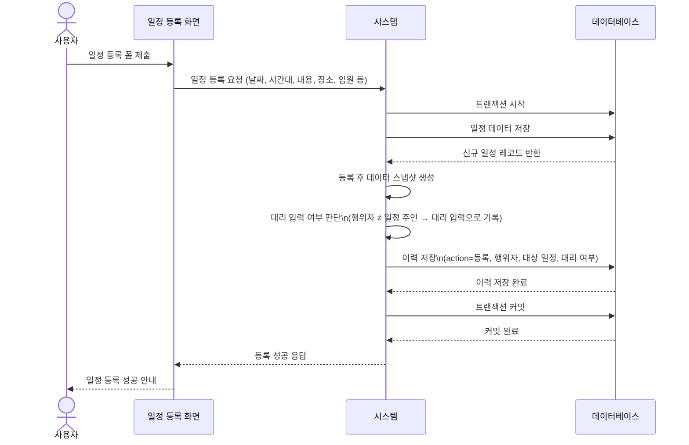
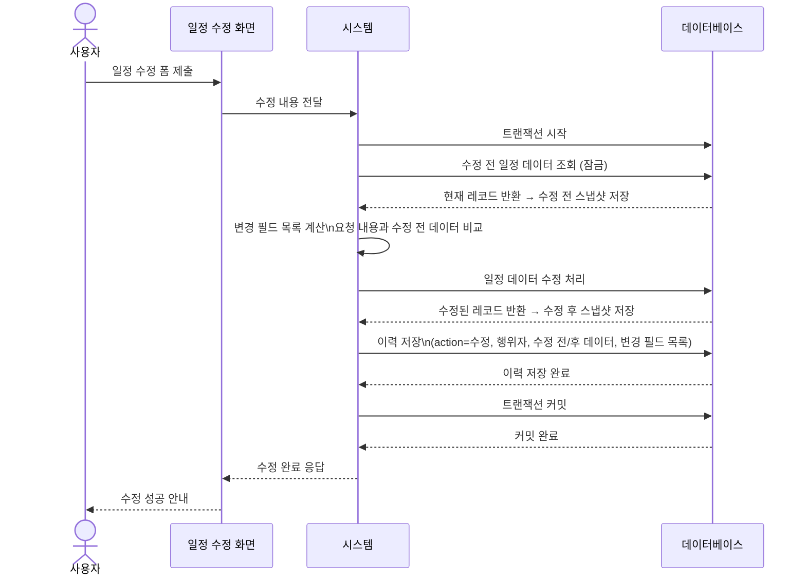
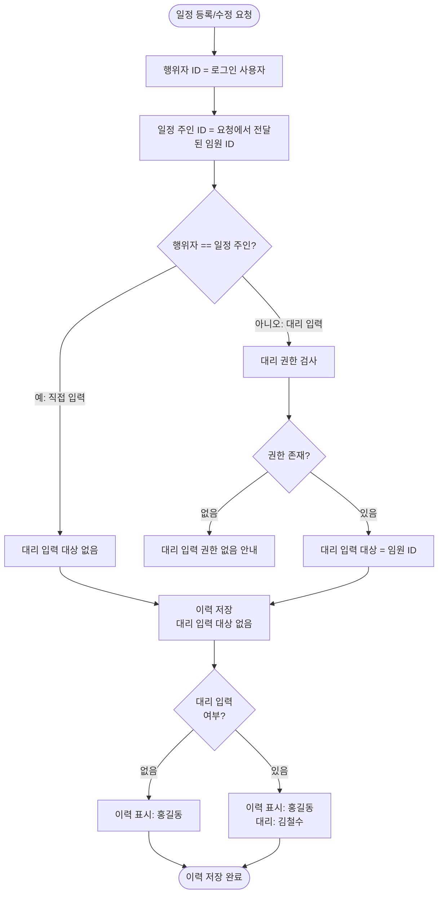
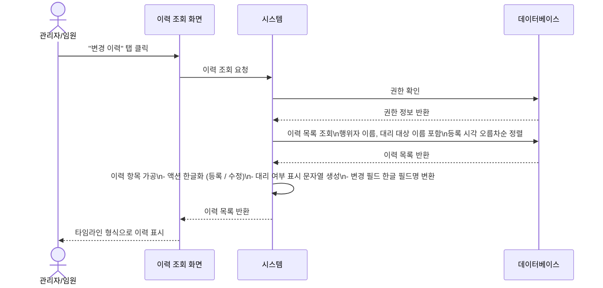

# 이력 저장 프로세스 정의서

**관련 화면 명세**: [spec/12_audit_log.md](../spec/12_audit_log.md)

---

## PROC-AUD-001: 일정 등록 이력 저장 프로세스

### 개요

일정이 등록되는 즉시 해당 등록 행위를 `audit_logs` 테이블에 기록하는 프로세스이다. 누가, 언제, 어떤 일정을 등록했는지 추적할 수 있으며, 대리 입력의 경우 `on_behalf_of_id` 필드로 실제 일정 주인을 식별한다. 이력은 수정 또는 삭제가 불가한 불변(immutable) 로그로 관리된다.

### 참여자 (Actor)

| 구분 | 설명 |
|---|---|
| 사용자 (일반/관리자) | 일정을 직접 등록하는 주체 |
| 시스템 | 일정 저장 및 이력 기록 처리 |

### 사전 조건

- 사용자가 로그인 상태이며 일정 등록 권한이 있어야 한다.
- `schedules` 테이블과 `audit_logs` 테이블이 정상 운영 중이어야 한다.
- 트랜잭션 범위 내에서 일정 등록과 이력 저장이 함께 처리되어야 한다.

### 트리거

일정 등록이 성공한 직후 (동일 트랜잭션 내에서 자동 연계).

### 메인 플로우

### 대안 플로우

| 상황 | 처리 방식 |
|---|---|
| 대리 입력 (행위자 ≠ 일정 주인) | `on_behalf_of_id` 필드에 실제 임원(일정 주인) ID 저장 |
| 시스템 자동 등록 (배치) | 행위자 = 시스템 계정, `on_behalf_of_id` = null |

### 예외 플로우

| 예외 상황 | 처리 |
|---|---|
| 이력 저장 실패 | 트랜잭션 전체 롤백 — 일정 저장도 함께 취소, 오류 안내 |
| 트랜잭션 타임아웃 | 롤백, 재시도 안내 |

### 사후 조건

- `schedules` 테이블에 신규 일정 레코드가 존재한다.
- `audit_logs` 테이블에 `action = 'create'`인 이력 레코드가 생성된다.
- 이력 레코드는 수정·삭제 불가 상태로 보관된다.

### 연관 테이블

| 구분 | 상세 |
|---|---|
| `schedules` 테이블 | id, type, owner_id, schedule_date, time_slot, start_time, end_time, is_all_day, title, location, memo, created_by, on_behalf_of_id, created_at |
| `audit_logs` 테이블 | id, action, actor_id, target_id, target_type, on_behalf_of_id, before_data (JSON), after_data (JSON), changed_fields (배열), created_at |

---

## PROC-AUD-002: 일정 수정 이력 저장 프로세스

### 개요

일정이 수정될 때, 수정 전·후 상태를 모두 `audit_logs` 테이블에 기록하는 프로세스이다. 변경된 필드 목록(`changed_fields`)을 배열로 저장하여 어떤 항목이 바뀌었는지 빠르게 식별할 수 있다. 수정 직전 레코드를 먼저 조회한 후 수정을 실행하여 수정 전(`before_data`)과 수정 후(`after_data`) 모두 캡처한다.

### 참여자 (Actor)

| 구분 | 설명 |
|---|---|
| 사용자 (일반/관리자) | 일정을 수정하는 주체 |
| 시스템 | 수정 전·후 데이터 캡처 및 이력 저장 처리 |

### 사전 조건

- 사용자가 로그인 상태이며 해당 일정에 대한 수정 권한이 있어야 한다.
- 수정 대상 일정이 `schedules` 테이블에 존재해야 한다.
- 트랜잭션 범위 내에서 수정 전 조회 → 수정 → 이력 저장이 순서대로 처리되어야 한다.

### 트리거

일정 수정 요청이 들어와 일정 업데이트가 실행될 때.

### 메인 플로우

### 대안 플로우

| 상황 | 처리 방식 |
|---|---|
| 변경 내용이 실제로 없는 경우 (동일 값 전송) | 변경 필드 목록 = [], 이력 저장 스킵 (불필요한 이력 생략) |
| 대리 입력자가 수정하는 경우 | on_behalf_of_id = 실제 임원 ID로 설정하여 이력 기록 |

### 예외 플로우

| 예외 상황 | 처리 |
|---|---|
| 동시 수정 충돌 | 재시도 안내 또는 충돌 안내 반환 |
| 이력 저장 실패 | 트랜잭션 전체 롤백 — 일정 수정도 함께 취소 |
| 수정 권한 없음 | 권한 없음 안내, 이력 저장 없음 |

### 사후 조건

- `schedules` 테이블의 해당 레코드가 수정된다.
- `audit_logs` 테이블에 `action = 'update'`, 수정 전 데이터, 수정 후 데이터, 변경 필드 목록을 포함한 이력 레코드가 생성된다.

### 연관 테이블

| 구분 | 상세 |
|---|---|
| 변경 필드 예시 | `['title', 'location', 'start_time', 'end_time']` |
| `audit_logs` 테이블 | id, action, actor_id, target_id, target_type, on_behalf_of_id, before_data (JSON), after_data (JSON), changed_fields (배열), created_at |

---

## PROC-AUD-003: 대리 입력 이력 구분 저장 프로세스

### 개요

비서 또는 관리자가 임원을 대신하여 일정을 등록·수정할 때, 실제 행위자(actor)와 일정 소유자(임원)를 명확히 구분하여 이력에 기록하는 프로세스이다. `on_behalf_of_id` 필드를 활용하여 "누가(actor_id) 누구를 대리하여(on_behalf_of_id) 작업했는지"를 추적한다. 이력 조회 시 UI에서 "홍길동(대리: 김철수)" 형식으로 표시된다.

### 참여자 (Actor)

| 구분 | 설명 |
|---|---|
| 대리 입력자 | 비서, 관리자 등 임원을 대신하여 일정을 입력하는 사용자 |
| 임원 (일정 소유자) | 실제 일정의 주인, 대리 입력 대상 |
| 시스템 | 대리 여부 판단 및 이력 기록 처리 |

### 사전 조건

- 대리 입력자가 로그인 상태이며 해당 임원의 일정에 접근할 수 있는 권한이 있어야 한다.
- 요청에서 임원 ID가 명확히 전달되어야 한다.

### 트리거

PROC-AUD-001(일정 등록) 또는 PROC-AUD-002(일정 수정) 흐름 내에서 행위자 ≠ 일정 주인 조건이 충족될 때 자동 분기.

### 메인 플로우

### 대안 플로우

| 상황 | 처리 방식 |
|---|---|
| 관리자(admin)가 모든 임원 일정에 대리 입력 | 관리자는 별도 권한 검사 없이 대리 입력 허용, 대리 입력 대상 = 임원 ID로 설정 |
| 본인 일정 직접 입력 | 대리 입력 대상 없음, 이력 표시에 대리 정보 없음 |

### 예외 플로우

| 예외 상황 | 처리 |
|---|---|
| 대리 권한이 만료된 경우 | 권한 없음 안내, "대리 입력 권한이 없습니다" 메시지 |
| 임원이 존재하지 않는 경우 | 존재하지 않음 안내 |

### 사후 조건

- `audit_logs` 테이블에 행위자(실제 입력자)와 대리 입력 대상(임원)이 모두 기록된 이력이 저장된다.
- 이력 조회 UI에서 대리 입력 여부를 시각적으로 구분하여 표시할 수 있다.

### 연관 테이블

| 구분 | 상세 |
|---|---|
| 연계 프로세스 | PROC-AUD-001 (등록), PROC-AUD-002 (수정) |
| `audit_logs` 필드 | `actor_id` (실제 행위자), `actor_name_snapshot`, `on_behalf_of_id` (임원, nullable), `on_behalf_of_name_snapshot` |
| `proxy_permissions` 테이블 | `proxy_user_id`, `target_user_id`, `granted_by`, `granted_at`, `revoked_by`, `revoked_at` (active: `revoked_at IS NULL`) |
| UI 표시 형식 | `{actor_name_snapshot}(대리: {on_behalf_of_name_snapshot})` |

---

## PROC-AUD-004: 이력 조회 프로세스

### 개요

관리자 또는 권한 있는 임원이 특정 일정의 변경 이력을 시간순으로 조회하는 프로세스이다. 해당 일정의 `audit_logs`를 조회하고, 프론트엔드 타임라인 UI에서 변경 내역을 시각적으로 표시한다.

### 참여자 (Actor)

| 구분 | 설명 |
|---|---|
| 관리자 / 임원 | 이력 조회 권한을 보유한 사용자 |
| 이력 조회 UI | 일정 상세 페이지 내 "변경 이력" 탭 또는 패널 |
| 시스템 | 이력 데이터 조회, 행위자 정보 변환, 결과 가공 처리 |

### 사전 조건

- 사용자가 로그인 상태이며 해당 일정에 대한 조회 권한이 있어야 한다.
- 조회 대상 일정 ID가 `schedules` 테이블에 존재해야 한다.

### 트리거

사용자가 일정 상세 페이지에서 "변경 이력" 탭을 클릭하거나, 관리자 페이지에서 특정 일정의 이력 조회를 요청할 때.

### 메인 플로우

### 대안 플로우

| 상황 | 처리 방식 |
|---|---|
| 이력이 1건도 없는 경우 | 빈 목록 반환, UI에서 "변경 이력이 없습니다" 표시 |
| 대량 이력 처리 | 페이지네이션으로 분할 표시 |

### 예외 플로우

| 예외 상황 | 처리 |
|---|---|
| 조회 권한 없음 | 권한 없음 안내 |
| 일정 ID 존재하지 않음 | 존재하지 않음 안내 |
| DB 조회 실패 | 오류 안내, 재시도 안내 |

### 사후 조건

- 사용자 화면에 해당 일정의 전체 변경 이력이 시간순 타임라인으로 표시된다.
- 각 이력 항목에 행위자, 대리 여부, 변경 내용, 변경 시각이 표시된다.

### 연관 테이블

| 구분 | 상세 |
|---|---|
| `audit_logs` 테이블 | id, action, actor_id, target_id, target_type, on_behalf_of_id, before_data, after_data, changed_fields, created_at |
| UI 표시 예시 | `2026-05-11 09:00 / 등록 / 홍길동(대리: 김철수)` |
